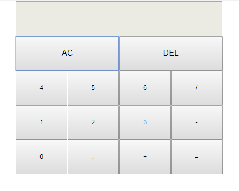

# 网页版简易计算器
## 一、实验介绍

>* 1.1 实验内容

我们在生活中经常会用到计算器，今天我们就来做一个网页版的，先上一张游戏效果图：



网页版需要我们点击按钮。为了使代码尽量简单，逻辑清晰，只保留了实现这个小计算器最重要的部分代码，让初学者也能很快看懂。

>* 1.2 实验知识点

HTML+CSS+JavaScript

>* 1.3 适合人群

本实验难度较为简单，非常适合刚学完 HTML, CSS 和 JavaScript 的人拿来练手。

## 二、实验原理

在开始编程之前，让我们先来分析下整个计算机的流程：这个是非常简易的计算器，可以完成的功能有加减乘除和AC（清屏），DEL（退格）等基本运算，所以代码也不复杂


## 三、开发准备

本实验所有代码都写在 index.html 一个文件中，实验过程中有不明白的地方可以参考后面给出的完整代码。

## 四、实验步骤

>* 4.1 页面布局

可以用 div+css 布局来实现计算机的静态效果展示，直接上 HTML 代码，我来简要说下 HTML 思路，整个框架我利用<table>搭建的，需要注意的是，由于计算器屏幕不可输入，我设置为了disabled，我们这里现在是静态页面就自己确定了，然后通过 css 控制样式。
```python

<!DOCTYPE html>
<html>
	<head>
		<meta charset="UTF-8">
		<title>简易计算器calculator</title>
		<link rel="stylesheet" href="css/calculator.css" />
		<script type="text/javascript" src="js/calculator.js"></script>
	</head>
	<body>
		<table>
			<tr>
				<td colspan="4"><input type="text" class="txt" disabled /></td>
			</tr>
			<tr>
				<td colspan="2"><input type="button" class="btn_click" value="AC" /></td>
				<td colspan="2"><input type="button" class="btn_click" value="DEL" /></td>
			</tr>
			<tr>
				<td><input type="button" class="btn" value="4"/></td>
	            <td><input type="button" class="btn" value="5"/></td>
	            <td><input type="button" class="btn" value="6"/></td>
	            <td><input type="button" class="btn" value="/"/></td>
			</tr>
			<tr>
				<td><input type="button" class="btn" value="1"/></td>
	            <td><input type="button" class="btn" value="2"/></td>
	            <td><input type="button" class="btn" value="3"/></td>
	            <td><input type="button" class="btn" value="-"/></td>
			</tr>
			<tr>
				<td><input type="button" class="btn" value="0"/></td>
	            <td><input type="button" class="btn" value="."/></td>
	            <td><input type="button" class="btn" value="+"/></td>
	            <td><input type="button" class="btn" value="="/></td>
			</tr>
		</table>
	</body>
</html>

```
>* 4.2 添加样式

下面是css代码。
```python

    * {
	padding: 0;
	margin: 0;
}
table {
	/*
	 * 为表格设置合并边框模型border-collapse: collapse;
	 */
	border-collapse: collapse;
	margin: 0 auto;
	border-spacing: 0px;
}
td {
	width: 150px;
	height: 100px;	
}
input {
	width: 150px;
	height: 100px;
}
.btn {
	width: 150px;
	font-size: 12px;
}
.btn_click {
	width: 302px;
	font-size: x-large;
}
.txt {
	width: 600px;
    font-size: x-large;
    text-align: right;
}

```
如果以上部分你都能够理解并且对应着代码实现的话，那么你现在应该会出现这样的效果：


是不是很像计算器的界面了呢，我们已经成功了一大步，然后就是通过 js 来实现一些事件以及响应啦，就算完成啦。

>* 4.3 思路讲解

第一部分：获取值到屏幕上


```python
    //获取并保存你想操作的元素
    var btn_txt = document.getElementsByClassName("btn");
    var txt = document.getElementsByClassName("txt")[0];
    //对他们添加操作：
  for (var i = 0; i < btn_txt.length; i++) {
      btn_txt[i].onclick = function () {  
}

```
在进行操作的之前请等一下，请我们思考一下，btn_txt数组里存放着0,1,2,3,4,5,6,7,8,9，" . "，" + "，" - "，" * "，" \ "，" = "等一系列东西，我们当然要对数字和计算符号进行分开操作，所以我们用If……else……来判断一下

```python
 if (!isNaN(this.value) || this.value == ".") {
            /*用户输入的是数字或者点的情况*/
           /* this 指代的是当前事件的执行对象*/
}
 else{
           /*用户输入的是符号的情况*/
}
```

接下来先考虑用户输入的是数字或者点的情况，数字可以连续输入到屏幕里，但是小数点不应该能连续输入到屏幕里，小数点应该只有一个才对，所以我们应该先加一个判断条件：屏幕里是否有小数点存在？如果屏幕里已经有小数点存在，那么我只允许你再输入数字，否则屏幕值不会接收，即是如下代码：
```python
 if (!isNaN(this.value) || this.value == ".") {
         /*用户输入的是数字或者点的情况*/
         /* this 指代的是当前事件的执行对象*/

         /*有点存在的情况*/
      if (txt.value.indexOf(".") != -1) {
      /*indexOf() 用来查找字符  如果有 返回当前位置  如果没有 返回-1*/
            if (this.value != ".") {
            /*当前按得不是点，进行拼接*/
            txt.value += this.value;
            /*这里的txt.value += this.value;意思是
            将当前用户所按的数字添加到屏幕上去*/
           }
   }
            else {
           /*没点存在直接拼接*/
                  txt.value += this.value;
           }
  }

else{
           /*用户输入的是符号的情况接下来再考虑*/
}
```
用户输入的是数字或者点的情况已经考虑结束了，现在考虑用户输入的是运算符号的情况！这种情况也分两部分，一种是用户按了等号，一种是按了除等号之外的其他加减乘除运算符号，因为等号比较特殊一点，按了就直接应该得出结果了，所以要区用if……else……分开。
还有一个事情我们要考虑的是，我希望在我按下加减乘除运算符号时可以清屏，这样我就可以继续键入下一数字了（举例：我按下数字“8”，再按下运算符“ + ”，按下瞬间屏幕清屏，然后我再键入数字“4”，最后按下“ = ”，最后得出结果“12”），但是清屏我并不想让我的数据丢失，所以此时我先新建一个数组来保存这些数据（这里的“数据”指数字和运算符，也叫“表达式”），然后再清屏！具体代码如下：
```python
 var arr = [];
/*先自定义一个数组  来接收用户按的数字和计算符号
注意这里定义要在开头定义，而不是在函数内部*/

if (!isNaN(this.value) || this.value == ".") {
         /*用户输入的是数字或者点的情况*/
        /*上面已经讨论过了，这里我省点地方*/
}

else{
    /*用户输入的是符号的情况*/
    //先存值  在清屏
    if (this.value != "=") {
       /*是符号但不为等号的情况*/
       arr[arr.length] = txt.value;
        //存符号
       arr[arr.length] = this.value;
        //清屏
       txt.value = "";
   }
    else{
      /*为等号的情况下面讨论*/
  }
}
```

第二部分：计算屏幕上的表达式的值

好了下面我们讨论用户按下等号键的情况，这种比较简单，直接对表达式（表达式就是我们之前输入的数字与符号组合）进行计算就可以啦，需要注意的是计算完成之后要把保存表达式的数组arr清空，因为本次运算完满结束了，如果不清空里面的数据会影响下一次正常计算；
```python
else {
       /*为等号的情况即是计算屏幕上表达式的值*/

       //先将屏幕上所有值保存到数组里
       arr[arr.length] = txt.value;
       //eval()方法   专门用来计算表达式的值
       //join()方法   将数组的每位拼接成字符串
       txt.value = eval(arr.join(""));
       //计算完成之后将数组清空
       arr = [];
 }
```
第三部分：添加AC，DEL功能

首先，获取清空按钮和退格按钮，然后把它们保存在btn_back变量下；
然后就遍历进行添加功能，这里同样需要一个if……else……语句来判断用户按的是AC按钮还是DEL按钮
```python
var btn_back = document.getElementsByClassName("btn_click");
//获取清空按钮和退格按钮
 for (var i = 0; i < btn_back.length; i++) {
     btn_back[i].onclick = function () {
     //判断按钮
     if (this.value == "AC") {
     //如果是AC按钮，那么清空屏幕和数组里的一切值
         arr = [];
         txt.value = "";
    }
     else {
     //不是AC，那必然是DEL，我们把屏幕的最后一位抹去再重新赋给屏幕

     /* slice(参数1，参数2) 截断字符串 
     */
         txt.value = txt.value.slice(0, txt.value.length - 1);
    }
   }
}
```
到这里为止，所有功能基本上全部添加完毕

其实程序写到这里，几个核心的功能点都已经实现了，是不是感觉很简单呢，剩下来的就是将这些方法组合起来，组成完整的逻辑关系，在我给出的源码里有添加一个记分器记录用户分数的功能，同时设置加速方法，使黑块的移动越来越快等等，有兴趣的的同学可以尝试着添加事件按钮，使这个游戏更接近 APP 版本。

>* 4.6 js完整代码
```python
window.onload=function () {
	//定义数组  来接收用户按的数字和计算符号
	var arr=[],
	//获取按钮对象
		 btn_txt=document.getElementsByClassName('btn'),
	//获取屏幕元素
		 txt=document.getElementsByClassName('txt')[0],
	//获取清空按钮和退格按钮
		 btn_back=document.getElementsByClassName('btn_click');
	//事件监听兼容浏览器
		function addEvent(element,type,handle){
			if(element.addEventListener){
				element.addEventListener(type,handle,false);
			}else if(element.attachEvent){
				element.attachEvent("on"+type,handle);
			}else{
				element['on'+type]=handle;
			}
		}
	//AC和DEL的修改功能
		function change(){
				if(this.value=="AC"){
					arr=[];
					txt.value='';
				}else{
					/* slice() 截断字符串 */
					txt.value=txt.value.slice(0,txt.value.length-1);
				}
			}
	//数组计算函数
		function calculator(){
				/*
				 * this指代的是当前事件的执行对象
				 * 按完键将值传给屏幕
				 * 判断是否为数字
				 */
				if(txt.value==''&&this.value=="."){
					txt.value="0.";
				}else{
					if(!isNaN(this.value)||this.value=="."){
						/*用户输入的是数字或者点的情况*/
	                    /*indexOf() 用来查找字符  如果有返回当前位置  如果没有返回-1*/
						if(txt.value.indexOf('.')!=-1){
							if(this.value!="."){
								txt.value+=this.value;
							}
						}else{
								txt.value+=this.value;
						}
					}else{
						/*是符号的情况*/
	                    //先存值  在清屏
	                    if(this.value!="="){
	                     /*是符号但不为等号的情况*/
	                        arr[arr.length] = txt.value;
	                        //存符号
	                        arr[arr.length] = this.value;
	                        //清屏
	                        txt.value = "";
	                    }else{
	                        arr[arr.length]=txt.value;
	                        txt.value=eval(arr.join(''));
	                        arr=[];
	                    }	
					}
				}
			}
	//给AC，DEL添加点击事件
	for(var i=0;i<btn_back.length;i++){
		addEvent(btn_back[i],"click",change);	
	}
	//遍历循环给每一个给btn_txt数组对象添加事件
	for(var i=0;i<btn_txt.length;i++){
		addEvent(btn_txt[i],"click",calculator);
	}
}

```
五、实验总结

仅仅一百多行代码我们就实现了一个简单有趣的计算器。如果你刚入门前端，相信这个例子可以很好的让你理解，联系如何使用 JavaScript 操作 DOM.

有时候，虽然素未谋面，却相识已久，很微妙也很知足
相遇在互联网的世界
如果你巧好碰到有不懂，or 有疑问欢迎加入我们学习交流
你有更好的见解，更加优美的代码，我们可以一起学习讨论
懂或不懂，学或不学，都可以加入我们的团队：637481811