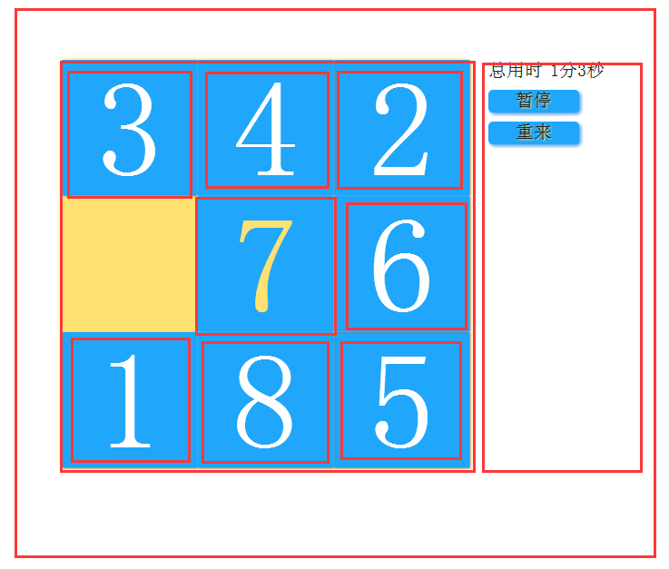
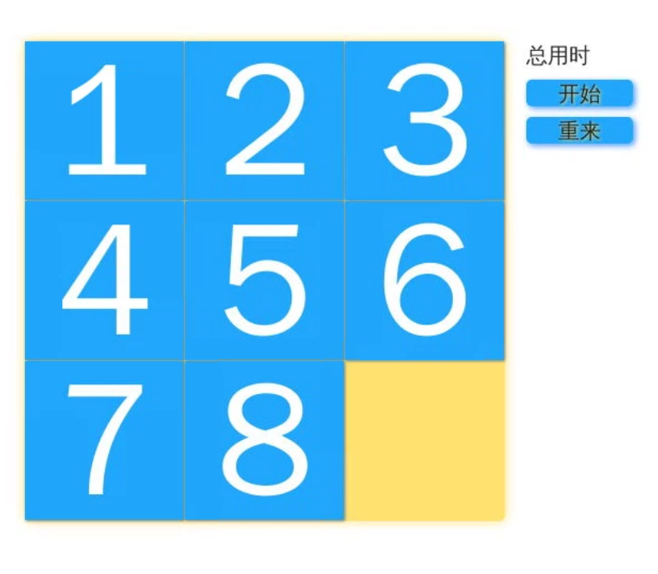

# 网页版拼图游戏
## 一、实验介绍

### 1.1 实验内容

本课程基于 HTML+CSS+JavaScript 实现网页版的拼图游戏。实现过程中将用到 HTML5，CSS3 及 JavaScript 相关知识。完成这个项目，可以进一步扎实前端基础知识。

九宫格拼图相信大家都玩过了，看似简单的小游戏，但实现起来其实并不那么简单。在以前，写程序是程序员的专利，只有他们才能做出一个软件来。但是现在不同了。科技的进步和经济的发展，使得每个人都可以使用计算机。特别是 HTML5 和 CSS3 的流行，使得制作一个基本的游戏变得简单。

下面我们就来做一个九宫格拼图。它的玩法是移动空格块旁边的方块，使得它们按照方块上面标的数字顺序排好。最终的效果：



### 1.2 实验知识点

本实验涉及以下知识点：

HTML5
CSS3
JavaScript

### 1.3 适合人群

本课程难度一般，适合刚学完前端基础（HTML+CSS+JavaScript）的同学作为练手项目。

### 1.5 代码参考

本课程中的源码仅供参考可以通过以下方式获取：

 https://github.com/sunseekers/JavaScript-30day/tree/master/%E7%BD%91%E9%A1%B5%E7%89%88%E6%8B%BC%E5%9B%BE%E6%B8%B8%E6%88%8F
## 二、实验原理

根据下面的效果图来观察思考，我们要做的就是设置一个大 DIV 用来包裹里面的小 DIV，然后在里面设置 8 个小 DIV，从 1 开始给他们编号。右边设置两个按钮，点击开始的时候开始计时，完成拼图后停止计时，并弹出一个框，提示完成了。重来按钮是当用户觉得当前有难度的时候，点击重来可以重新开始一个新的拼图，把所有方块打乱顺序，然后开始计时。


我们的重点就是当鼠标点击其中一个方块时，要判断当前方块是否可移动，如果可移动，则移动到相应的位置，如不可移动，则不做任何事。当移动完一块后，要判断是否完成拼图。

我们把那个大 DIV 想象成一个盒子，它有九个位置，从 1 开始，到9编号，他们的位置和编号都是不会变的。把里面的 8 个小 DIV 想象成 8 个小盒子，给他们设置 top 和 left 就可以控制他们的位置。每个小 DIV 从 1 开始到 8 编号。他们的位置是可以随意改变的。所以当小 DIV 的编号和大 DIV 的编号全部重合时，就完成了拼图。

所以重点就只有一个了。那就是如何判断是否可移动。这个也简单。我们设置一个一维数组变量，用来保存大 DIV 它里面装的小 DIV 的编号。如果大 DIV 没有小方块，也就表面它是空白块，那么就设为 0。如果当前大 DIV 有小 DIV，那就设置为小 DIV 的编号。然后再设置一个二维数组变量，用来保存大 DIV 的可移动编号。也就是保存这个大 DIV 它所有的可去的位置。比如大 DIV 编号为 2 的，它只能向 1号，3号，5号这三个方向移动。又比如 5，它能向 2、4、6、8 这四个方向移动。我们循环遍历这个变量，如果对应的方向它

没有方块，也就是值为 0，那么它就可以往这个方向移动了。


## 三、实验步骤

## 3.1 编写布局

在puzzle.html中我没有下面的代码：
```python
<!DOCTYPE html>
<html>
	<head>
		<meta charset="UTF-8">
		<title>拼图游戏</title>
		<link rel="stylesheet" href="css/puzzle.css">
		<script type="text/javascript" src="js/puzzle.js"></script>
	</head>
	<body>
		<div id="contain">
			<div id="game">
				<div id="d1" onclick="move(1)">1</div>
				<div id="d2" onclick="move(2)">2</div>
	            <div id="d3" onclick="move(3)">3</div>
	            <div id="d4" onclick="move(4)">4</div>
	            <div id="d5" onclick="move(5)">5</div>
	            <div id="d6" onclick="move(6)">6</div>
	            <div id="d7" onclick="move(7)">7</div>
	            <div id="d8" onclick="move(8)">8</div>
			</div>
			<div id="control">
				<span id="timeText">总用时</span>
				<span id="timer"></span>
				<input type='button' id="start" onclick="start()" value="暂停">
				<input  type='button' id="reset" onclick="reset()" value="重来">
			</div>
		</div>
	</body>
</html>
```
布局文件就写完了。这里为了简化逻辑，更易编写代码，我们把所有操作都封装了。只要执行move(2)，就是点击了编号为2的小方块，后面的一系列操作都完成了。

### 3.2 编写样式 - CSS

布局写完了，现在我们为游戏编写样式，使得它更漂亮。在这一步，大家就可以自己自由发挥了，你可以写出自己的风格，让游戏更漂亮。也可以添加更多的元素来装饰你的游戏。但是注意了，游戏 DIV 的大小如果改变了，一定要记得修改 js 代码，稍后我们会详细讲解。

puzzle.css
```python
* {
	padding: 0;
	margin: 0;
	
}
/*
 * 给body设置100%的高度和宽度，这样就会根据浏览器屏幕大小自动适配
 */
body {
	width: 100%;
	height: 100%;
}
#contain {
	width: 620px;
	height: 450px;
	margin: 0 auto;
	margin:100px;
	border-radius: 1px;
	position: relative;
}
/*
 * 游戏区的DIV，这个大小是计算出来的，取决于小方块的大小
 * 这里设置小方块的大小为50px*50px；
 */
#game {
	width: 450px;
	height: 450px;
	border-radius: 5px;
	display: inline-block;
	background: #ffe171;
	box-shadow: 0 0 10px #ffe171;
	position: absolute;
}
/*
 * 小方块的大小，定位为绝对定位，这样改变位置不会影响其他元素的位置，
 * 宽高都是149px。注意了，我们还设置了box-shadow:1px 1px 2px #777 ；
 * 所以总宽度等于150px；transition：.3s设置过渡时间，是css3属性；
 */
#game div {
	width: 149px;
	height:149px;
	box-shadow: 1px 1px 2px #777;
	background: #20a6fa;
	color: #fff;
	text-align: center;
	font-size: 150px;
	line-height: 150px;
	cursor: pointer;
	position: absolute;
	-webkit-transition: .3s;/*浏览器前缀，兼容其他浏览器 chrome*/
       -moz-transition: .3s;/*firefox*/
        -ms-transition: .3s;/*ie*/
         -o-transition: .3s;/*opera*/
			transition: .3s;
}
#game div:hover { color: #ffe171;}
#control {
	width: 150px;
	height: 450px;
	display: inline-block;
	float: right;
}
/*
 * 设置控制区域的共同样式
 */
#control span,
#control input {
	height: 35px;
	font-size: 20px;
	color: #222;
	margin-top:10px;
	text-align: center;
}
input:nth-child(3) {
	width: 100px;
	line-height: 35px;
	font-size: 28px;
	background: #20a6fa;
	color: #ffe171;
	text-shadow: 1px 1px 2px #ffe171;
	border-radius: 5px;
	box-shadow: 2px 2px 5px #4c98f5;
	
	cursor: pointer;
	display: inline-block;
}
input:nth-child(4) {
	width: 100px;
	line-height: 35px;
	background: #20a6fa;
	color: #ffe171;
	text-shadow: 1px 1px 2px #ffe171;/*字体阴影*/
	box-shadow: 2px 2px 5px #4c98f5;/*盒子阴影*/
	border-radius: 5px;
	cursor: pointer;
}
/*给Reset按钮设置属性*/
#d1{
    left: 0px;
}
#d2{
    left: 150px;
}
#d3{
    left: 300px;
}
#d4{
    top: 150px;
}
#d5{
    top: 150px;
    left: 150px;
}
#d6{
    top: 150px;
    left: 300px;
}
#d7{
    top: 300px;
}
#d8{
    left: 150px;
    top: 300px;
}
/*这是预先给每个小方块按照顺序排好位置*/
```
/*这是预先给每个小方块按照顺序排好位置*/
好了，样式也编写好了。最后再编写一个 js 控制代码，我们的拼图就可以用了。编写样式的时候大家还是先根据我这里的来，等完成了整个游戏，了解游戏逻辑的时候你们再自己发挥想象力去更改样式，不然可能会出现未知的错误。

完成这步，打开 puzzle.html 应该能看到下面的效果了：



### 3.3 控制代码 - JavaScript

puzzle.js
```python
var time=0,
	pause=true,
	set_timer=null,
	//保存大div当前装的小div的编号
	d_direct=[
		[0],//为了逻辑更简单，第一个元素我们不用，我们从下标1开始使用
        [2,4],//大DIV编号为1的DIV可以去的位置，比如第一块可以去2,4号位置
        [1,3,5],
        [2,6],
        [1,5,7],
        [2,4,6,8],
        [3,5,9],
        [4,8],
        [5,7,9],
        [6,8]
	],
	//保存DIV编号的可移动位置编号
	d_posXY=[
		[0],//同样，我们不使用第一个元素
        [0,0],//第一个表示left,第二个表示top，比如第一块的位置为let:0px,top:0px
        [150,0],
        [300,0],
        [0,150],
        [150,150],
        [300,150],
        [0,300],
        [150,300],
        [300,300]
	];
	//默认按照顺序排好，大DIV第九块没有，所以为0，我们用0表示空白块
	d=[0,1,2,3,4,5,6,7,8,0];
	function move(id){
		var i=1;
		//保存小DIV可以去的编号，0表示不能移动
		var	target_d=0;
		//这个for循环是找出小DIV在大DIV中的位置
		for(i=1;i<10;++i){
			if(d[i]==id)break;
		}
		//用来找出小DIV可以去的位置，如果返回0，表示不能移动，如果可以移动，则返回可以去的位置编号
		target_d=whereCanTo(i);
		if(target_d!=0){
			 //把当前的大DIV编号设置为0，因为当前小DIV已经移走了，所以当前大DIV就没有装小DIV了
			d[i]=0;
			d[target_d]=id;
			document.getElementById('d'+id).style.left=d_posXY[target_d][0]+"px";
			document.getElementById('d'+id).style.top=d_posXY[target_d][1]+"px";
			//最后设置被点击的小DIV的位置，把它移到目标大DIV的位置
		}
		//如果target_d不为0，则表示可以移动，且target_d就是小DIV要去的大DIV的位置编号
		var finish_flag=true;
		//设置游戏是否完成标志，true表示完成
		for (var k=1;k<9;++k){
			if(d[k]!=k){
				finish_flag=false;
				break;
				//如果大DIV保存的编号和它本身的编号不同，则表示还不是全部按照顺序排的，那么设置为false，跳出循环，后面不用再判断了，因为只要一个不符，就没完成游戏
			}
		}
		//从1开始，把每个大DIV保存的编号遍历一下，判断是否完成
		if(finish_flag==true){
			if(!pause){
				start();
				alert('congratulation');
				//如果为true，则表示游戏完成，如果当前没有暂停，则调用暂停韩式，并且弹出提示框，完成游戏。
    //start()这个函数是开始，暂停一起的函数，如果暂停，调用后会开始，如果开始，则调用后会暂停
			}
		}
	}
	  //判断是否可移动函数，参数是大DIV的编号，不是小DIV的编号，因为小DIV编号跟可以去哪没关系，小DIV是会动的
	function whereCanTo(cur_div){
		var j=0,
			move_flag=false;
			for(j=0;j<d_direct[cur_div].length;++j){
				//把所有可能去的位置循坏遍历一下
				if(d[d_direct[cur_div][j]]==0){
					move_flag=true;
					break;
					//如果目标的值为0，说明目标位置没有装小DIV，则可以移动，跳出循环
				}
			}
			if(move_flag == true){
		        return d_direct[cur_div][j];
		    }else{
		        return 0;
		    }
    //可以移动，则返回目标位置的编号，否则返回0，表示不可移动
			
	}
	//定时器函数，每一秒执行一次
	function timer(){
		time+=1;
		var min = parseInt(time/60),
			sec = time%60;//取余就是秒
			document.getElementById('timer').innerHTML = min +"分"+sec+"秒";//然后把时间更新显示出来	
	}
	//开始暂停函数
	function start() {
		if(pause) {
			document.getElementById('start').value='暂停';
			pause = false;
			set_timer = setInterval(timer,1000);//启动定时器
		}else{
			document.getElementById('start').value='开始';
			pause = true;
			clearInterval(set_timer);
		}
	}
	//重置函数
	function reset(){
		time=0;
		random_d();//把方块随机打乱函数
		if(pause)//如果暂停，则开始计时
		start();
	}
	/*随机打乱方块函数，我们的思路是从第九快开始，随机产生一个数
	 * 然后他们两块对调一下
	 */
	function random_d(){
		for(var i=9;i>1;--i){
			var to=parseInt(Math.random()*(i-1)+1);//产生随机数，范围为1到i
			if(d[i]!=0){
				document.getElementById('d'+d[i]).style.left=d_posXY[to][0]+'px';
				document.getElementById('d'+d[i]).style.top=d_posXY[to][1]+'px';
			}
			if(d[to]!=0){
			document.getElementById("d"+d[to]).style.left=d_posXY[i][0]+"px";
			document.getElementById("d"+d[to]).style.top=d_posXY[i][1]+"px";
		}
			//把随机产生的div位置设置为当前的div的位置
			var tem = d[to];
				d[to]=d[i];
				d[i]=tem;
				//然后把她们的div保存的编号对调一下
		}
	}
//初始化函数，页面加载的时候调用重置函数，重新开始
window.onload=function(){
	reset();
}

```
好了，所有代码都已经编写完成了。现在点击桌面上的 puzzle.html 文件，右键用火狐浏览器打开，就能看到效果了。点击上面的方块就可以移动。

# 四、实验总结

通过本次实验，我们利用 HTML5 + CSS3 + JavaScript，实现了一个简单的拼图游戏。

这里说明一下，因为实验中使用的随机打乱方块的算法非常简单，但是存在 bug，有 50% 的概率生成的顺序是无法复原的，这个时候就只能点击重新开始。

因此思考如何实现更健全的算法，让其可以完全复原。

提供一种思路：按照人的方式随机去移动方块，而移动方块的代码已经写好了，直接调用就可以，所以只要自己编写一个函数，让方块移动几十步就可以打乱。而这种方式是一定可以拼回去的。

大家可以回去自己尝试。

# 五、课后习题

当前的实现是基于鼠标点击的，添加键盘监听，让游戏使用方向键也能玩
思考如何实现更健全的算法，让其可以完全复原