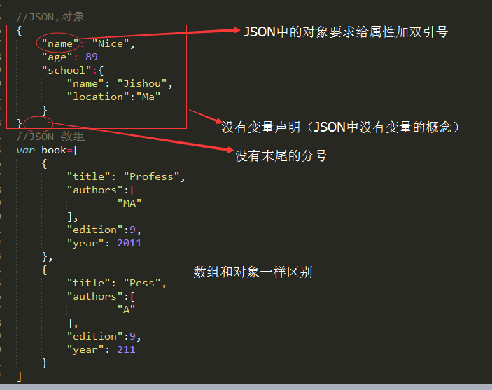

# JSON
JSON是JavaScript的一个严格子集；利用了JavaScript中的一些模式来表示结构化数据；JSON是一种<b>数据结构</b>,不是编程语言，JSON并不从属于JavaScript;

## 语法
JSON的语法
1.简单值：使用与JavaScript相同的语法，但是不包括undefined；

2.对象： 

3.数组：

## 解析与序列化

JSON数据结构解析为有用的JavaScript对象。JavaScript对象也可以序列化为JSON；

Stringify():JavaScript对象序列化为JSON字符串；
parse():JSON字符串解析为原生的JavaScript值；
具体用法区别见图：

