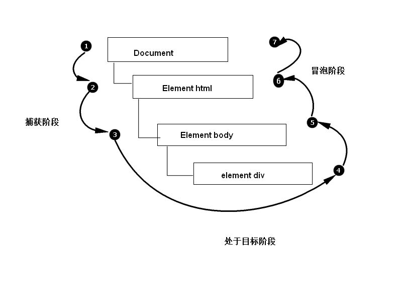
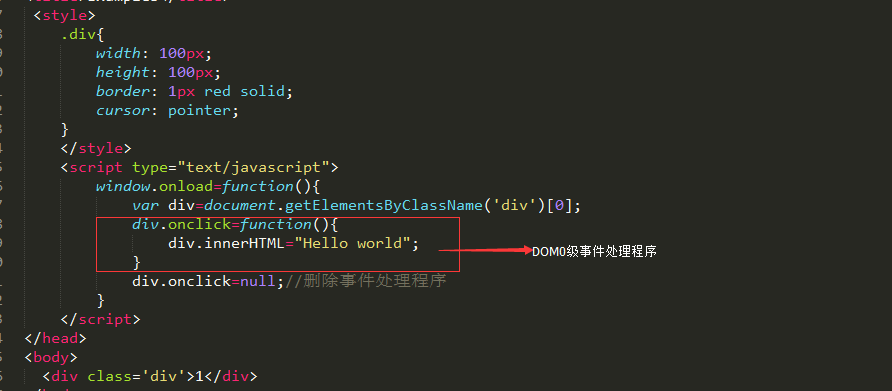
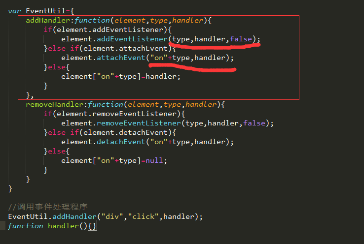
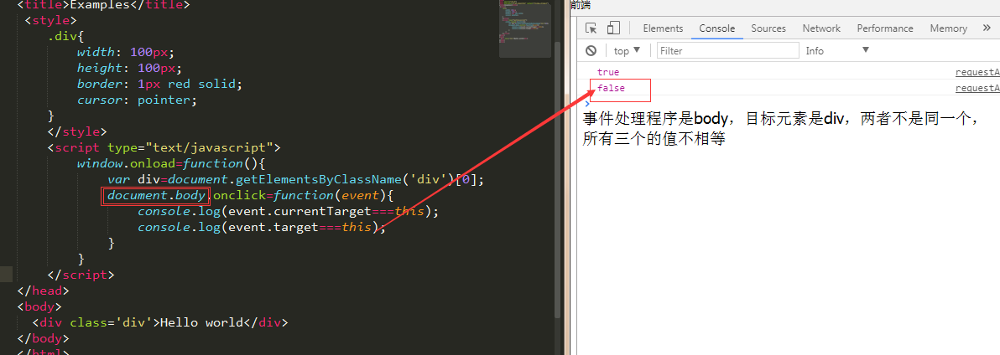
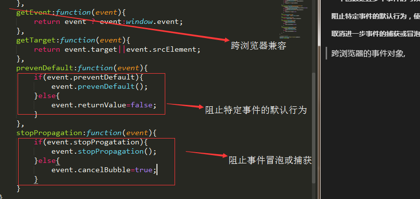

# 事件
JavaScript与HTML之间的交互是通过事件实现的。事件就是文档或浏览器窗口中发生的一些特定的<b>交互瞬间</b>可以通过侦听器（或处理程序）来预定事件；

## 事件流
我们事件冒泡，很少用事件捕获；
DOM事件流：DOM2级事件规定事件流包括三个阶段：事件捕获阶段，处于目标阶段和事件冒泡阶段；如图所示：


## 事件处理程序
事件就是用户或浏览器自身执行的某种动作，诸如，：click,load,mouseover都是事件的名字；而响应某个事件的函数就叫做<b>事件处理程序（事件侦听器）</b>
### DOM0级事件处理程序


### DOM2级事件处理程序


addEventListener()和removeEventListener()接受三个参数，要处理的事件名，作为事件处理程序的函数，和一个布尔值（true,表示是在捕获阶段调用事件处理程序）；用addEventListener添加的事件处理程序只能用removeEventListener()来移除，意味着addEventListener()添加的匿名函数将无法移除；

DOM2级方法添加事件处理程序的优点是可以添加多个事件处理程序。DOM0级只能添加一个事件处理程序，后面的会覆盖前面的；

大多数都是把事件处理程序添加到事件流的冒泡阶段

兼容ie8用:attachEvent()和detachEvent();详情如下仔细看每一点
跨浏览器的事件处理程序


## 事件对象
在触发DOM上的某个事件时，会产生一个事件对象event,这个对象包含着所有与事件有关的信息；包括导致事件的元素，事件类型以及特定的事件相关信息；
详细请参看[Event](https://developer.mozilla.org/zh-CN/docs/Web/API/Event)对象

在事件处理程序内部，对象this始终等于currentTarget的值（当前事件目标），而target则包含事件的实际目标。如果直接将事件处理程序指定了给目标元素，则this，currentTarget和target包含相同的值；


把事件处理程序给body，点击div元素；结果如下


<b>一个函数处理多个事件时可以使用type属性，查看触发事件的类型；（event.type）

阻止特定事件的默认行为，使用preventDefault();

取消进一步事件的捕获或冒泡用stopPropagation()方法</b>

### 跨浏览器的事件对象,



## HTML5事件
>* contextmenu事件：上下文菜单事件

contextmenu事件是<b>冒泡的</b>；contextmenu事件属于鼠标事件，所以其对象中包含与光标位置有关的所有属性。通常使用contextmenu事件来显示自定义的上下文菜单，而使用onclick事件处理程序来隐藏该菜单；


```python
<!DOCTYPE html>
<html>
	<head>
		<meta charset="UTF-8">
		<title>自定义网页右键菜单</title>
		<style>
			*{
				padding: 0;
				margin: 0;
				list-style: none;
				text-decoration: none;
			}
			#container{
				height: 100px;
				width: 100%;
				background: #f5f5f5;
				margin: 15px;
				border-radius: 10px;
				border: 2px solid #e3e3e3;
				font-size:30px;
				text-align: center;
				line-height: 100px;
				cursor:pointer;
			}
			#clickmenu{
				position: absolute;
				width: 200px;
				height: 80px;
				border: 2px solid #d0d0d0;
				border-radius: 10px;
				padding: 20px;
				visibility: hidden;
				background: #fff;
			}
			#clickmunu li{
				font-size: 20px;
			}
		</style>
	</head>
	<body>
		<div id="container">right click to see the menu</div>
		<ul id="clickmenu">
			<li><a href="">Menu Item1</a></li>
			<li><a href="">Menu Item2</a></li>
		</ul>
		<script>
			//兼容浏览器
			var EventUtil={
				addHandler:function(element,type,handler){
					if(element.addEventListener){
						element.addEventListener(type,handler,false);
					}else if(element.attachEvent){
						element.attachEvent("on"+type,handler);
					}else{
						element['on'+type]=handler;
					}
				},
				getEvent:function(event){
					return event?event:window.event;
				},
				preventDefault:function(event){
					if(event.preventDefault){
						event.preventDefault();
					}else{
						event.returnValue=false;
					}
				}
			};
      //事件绑定函数
			EventUtil.addHandler(window,"load",function(event){
				var container=document.getElementById("container");
				EventUtil.addHandler(container,"contextmenu",function(event){
					event=EventUtil.getEvent(event);
					EventUtil.preventDefault(event);
					var Ul=document.getElementById("clickmenu");
					if(event.clientX+244>screen.availWidth){
						Ul.style.left=event.clientX-244+"px";
					}else{
						Ul.style.left=event.clientX+"px";
					}
					if(event.clientY+124>screen.availHeight){
						Ul.style.top=event.clientY-124+"px";
					}else{
						Ul.style.top=event.clientY+"px";
					}
					Ul.style.visibility="visible";
				})
				EventUtil.addHandler(document,"click",function(event){
					document.getElementById('clickmenu').style.visibility="hidden";
				})
			});
		</script>
	</body>
</html>
```

>* hashchange事件: 在URL的参数列表（及URL中“#”号后面的所有字符串）发生变化时通知开发人员，之所以增加这个事件，是因为在Ajax应用中，开发人员经常要利用URL参数列表来保存状态或导航信息；

>* 设备事件（具体自行百度，不一一介绍）
orientationchange事件

MozOrientation事件

deviceorientation事件

devicemotion事件

### 触摸事件
> touchstart:当手触摸屏幕时触发；即使已经有一个手指放在了屏幕上也会触发；

> touchmove：当手指在屏幕上滑动时连续的触发；在这个事件发生期间，调用preventDefault()可以阻止滚动；

> touchend： 当手指从屏幕上移开时触发。

每个触摸事件的event对象都提供了鼠标事件中常见的属性；

#### 除了常见的DOM属性外，触摸事件还包括下列三个用于跟踪触摸的属性

> touches: 表示当前跟踪的触摸操作的Touch对象的数组

> targetTouchs: 特定于事件目标的Touch对象数组

> changeTouches: 表示自上次触摸以来发生了什么改变的Touch对象数组；

<b>Touch对象包含了一下属性：</b>
>* clientX: 触摸目标在视口中的x坐标；
>* clientY: 触摸目标在视口中的y坐标；
>* pageX  ：触摸目标在页面中的x坐标；
>* pageY  ：触摸目标在页面中的y坐标；
>* screenX: 触摸目标在屏幕中的x坐标；
>* screenY: 触摸目标在屏幕中的y坐标；
>* target ：触摸的DOM节点目标：
>* identifier： 标识触摸的唯一ID；

### 手势事件
gesturestart: 当一个手指已经按在屏幕上而另一个手指有触摸屏幕时触发

gesturechange： 当触摸屏幕的任何一个手指的位置发生变化时触发；

gestureend： 当任何一个手指从屏幕上面移开时触发；

触摸事件和手势事件之间的联系：
当一个手指放在屏幕上面时，会触发touchstart事件，如果另一个手指又放在屏幕上会先触发gesturestart事件，随后触发touchstart事件；其余的两个事件也一样；<b>优先考虑手势事件；</b>
### 内存和性能
每个函数都是对象，都会有占用内存；内存中的对象越多，性能就越差；

指定所有事件处理程序而导致的DOM访问次数，会延迟整个页面的交互就绪时间；

对“事件处理程序过多”问题的解决方案就是<b>事件委托</b>，事件委托利用了事件冒泡，减少时间，减少内存空间，提高整体性能；在不需要的时候移除事件处理程序；
