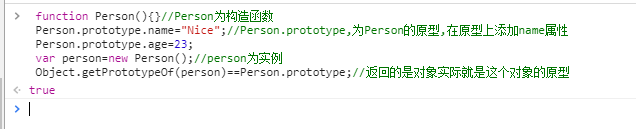
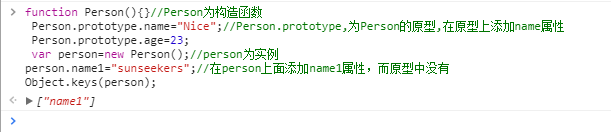
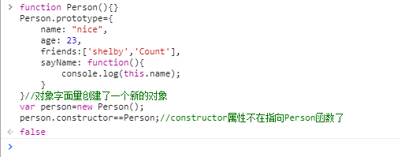
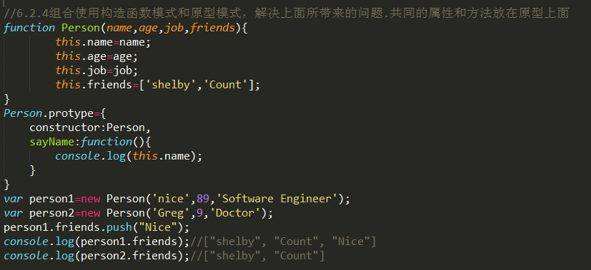
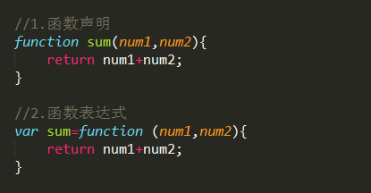
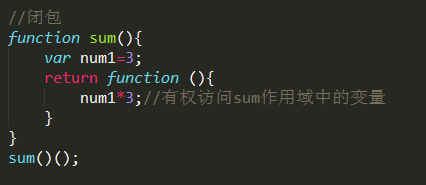
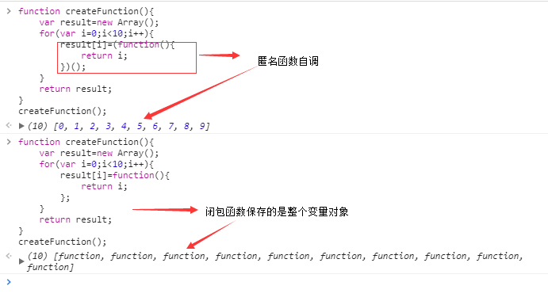

# 引用类型
> 引用类型的值（对象）是引用类型的一个实例；在ECMAScript中，引用类型是一种数据结构，用于将数据和功能组织在一起；

对象是某个特定引用类型的实例

基本类型值：简单的数据段；复制变量是复制变量的值；占据固定大小的空间，保存在栈内存中；

引用类型值：由多个值构成的对象，复制对象是对象的地址（指针）；保存在堆内存中

所有函数的参数都是按值传递的，参数是函数的局部变量；形参和实参最好不要一样，以免混淆；

检测类型：

typeof操作符确定一个变量是基本类型中的哪一种

instanceof操作符检测引用类型和基本类型；基本类型返回false；

执行环境：变量或者函数有权访问的其他数据，决定了她们各自的行为，每个执行环境都有一个变量对象；代码在环境中执行的时候会创建变量对象的一个作用域链；
访问局部变量比全局变量块；

## Object类型
目前我们接触的大多数引用类型值都是Object类型的实例

Object创建的方法：
>* 1.对象字面量
```python
var person={
    name: "Nice,
    age: 23
}
```
优点：代码量少，给人封装数据的感觉，也可以向函数传递大量可选参数；在实际开发中常用

>* 2.new 操作符后跟Object构造函数
```python
var person=new Object();
person.name="Nice;
person.age=23；
```
在开发中用的比较少
>* 3.工厂模式
```python
function createPerson(name,age){
    var o=new Object();
    o.name=name;
    o.age=age;
    return o;
}
var person=createPerson("Nice",23);
```
在开发中用的比较少

>* 4.构造函数模式
```python
function Person(name,age){
    this.name=name;
    this.age=age；
    this.sayName=function(){
        this.name;
    }
}
var person=new Person("Nice",23);
```
构造函数始终都应该以一个大写字母开头；
调用构造函数经历四个步骤：
> 1.创建一个新对象

> 2.将构造函数的作用域赋给新对象（this就职向这个新对象）

> 3.执行构造函数中的代码

> 4.返回新的对象

实例person有一个constructor（构造函数）属性，该属性指向Person（原型）；

构造函数的问题：每个方法都要在每个实例上重新创建创建一遍,不同的实例的同名函数是不想等；创建重复的方法；

解决构造函数：原型模式

每个函数都有一个prototype（原型）属性，这个属性是一个指针，指向一个原型对象；实例共享原型对象的属性和方法；

原型对象：只要创建了一个新函数，就会为该函数创建一个prototype属性，这个属性指向函数的原型对象。

在默认情况下，原型对象都会自动获取一个constructor（构造函数）属性，这个属性是一个指向prototype属性所在的指针；
即Person.prototype.constructor==Person;如图所示


>* Object.getPrototypeOf()返回的是对象实际就是这个对象的原型,如图所示

>* hasOwnProperty()方法检测一个属性是否存在实例中还是存在原型中，存在实例中返回true；反之,成立；

>* in操作符会在通过对象对象能够访问给定属性时返回true；无论该属性存在实例还是原型中；

> 只要hasOwnProperty()返回false，in操作符返回true；则该属性是原型属性；

>* for-in循环时，返回的是所有能够通过对象（包括原型属性和实例属性）访问的，可枚举的属性；

>* Object.keys(),返回对象上所有可枚举的实例属性的字符串数组；


> 注意：Person.prototype设置为一个对象字面量形式创建的新对象时，就切断了原来对象的联系（即constructor属性不在指向Person）

如果constructor的值很重要可以向在新对象中设置：

原因是，实例和原型之间的松散链接关系，实例中的指针只指向原型，而不指向构造函数

原型，原型对象，实例关系如下


原型对象的问题：修改实例造成原型对象被修改，共享本性所导致


解决方法：组合使用构造函数和原型模式,共同的属性和方法放到原型之上



继承
许多OO语言都支持两种继承方式：接口继承和现实继承；接口继承只继承方法签名，实现继承则继承实际的方法；但是由于函数没有签名，所有ECMAScript只支持实际继承。实现继承主要依靠原型链来实现；

利用原型让一个引用类型继承另一个引用类型的属性和方法；


> 1.在创建的对象中，数值属性名会自动转换字符串

> 2.一般来说访问对象的属性都是采用点表示法；方括号语法主要的优点是可以通过变量访问属性；除非我们必须要用变量来访问属性。否则一般不用方括号语法

[Object](https://developer.mozilla.org/zh-CN/docs/Web/JavaScript/Reference/Global_Objects/Object)对象的属性和方法

Object对象属性
Object.length=1
Object.prototype：可以为所有 Object 类型的对象添加属性。


Object对象方法：

 JavaScript共享本质，可能会导致对象被意外修改或者重写原生对象；一旦对象定义被修改，就无法撤回；

 解决办法： 防篡改对象

>* 1.不可扩展对象：Object.preventExtensions(),
>* 2.冻结对象：Object.freeze()
>* 3.密封对象：Object.seal() 

[Object.assign()](https://developer.mozilla.org/zh-CN/docs/Web/JavaScript/Reference/Global_Objects/Object/assign)：通过复制一个或多个对象来创建一个新的对象。

[Object.create()](https://developer.mozilla.org/zh-CN/docs/Web/JavaScript/Reference/Global_Objects/Object/create)：指定原型对象和属性来创建一个新的对象。

[Object.defineProperty()](https://developer.mozilla.org/zh-CN/docs/Web/JavaScript/Reference/Global_Objects/Object/defineProperty)：给对象添加一个属性并指定该属性的配置。

[Object.defineProperties()](https://developer.mozilla.org/zh-CN/docs/Web/JavaScript/Reference/Global_Objects/Object/defineProperties)：给对象添加多个属性并分别指定它们的配置。


[Object.freeze()](https://developer.mozilla.org/zh-CN/docs/Web/JavaScript/Reference/Global_Objects/Object/freeze)：冻结对象：使对象不可删除或修改它的属性。

[Object.getOwnPropertyDescriptor()](https://developer.mozilla.org/zh-CN/docs/Web/JavaScript/Reference/Global_Objects/Object/getOwnPropertyDescriptor)：返回对象指定的属性配置。

[Object.getOwnPropertyNames()](https://developer.mozilla.org/zh-CN/docs/Web/JavaScript/Reference/Global_Objects/Object/getOwnPropertyNames)：返回一个数组，它包含了指定对象所有的可枚举或不可枚举的属性名。

[Object.getOwnPropertySymbols()](https://developer.mozilla.org/zh-CN/docs/Web/JavaScript/Reference/Global_Objects/Object/getOwnPropertySymbols)：返回一个数组，它包含了指定对象自身所有的符号属性。

[Object.getPrototypeOf()](https://developer.mozilla.org/zh-CN/docs/Web/JavaScript/Reference/Global_Objects/Object/getPrototypeOf)：返回指定对象的原型对象。

[Object.is()](https://developer.mozilla.org/zh-CN/docs/Web/JavaScript/Reference/Global_Objects/Object/is)：判断两个值是否严格相等。（类似===运算符，但+0不等于-0，NaN等于自己）。

[Object.isExtensible()](https://developer.mozilla.org/zh-CN/docs/Web/JavaScript/Reference/Global_Objects/Object/isExtensible)：判断对象是否可扩展。

[Object.isFrozen()](https://developer.mozilla.org/zh-CN/docs/Web/JavaScript/Reference/Global_Objects/Object/isFrozen)：判断对象是否已经冻结。

[Object.isSealed()](https://developer.mozilla.org/zh-CN/docs/Web/JavaScript/Reference/Global_Objects/Object/isSealed)：判断对象是否已经密封。

[Object.keys()](https://developer.mozilla.org/zh-CN/docs/Web/JavaScript/Reference/Global_Objects/Object/keys)：返回一个数组，包含指定对象的所有自有可遍历属性的名称
。
Object.preventExtensions()：阻止对象扩展。

[Object.seal()](https://developer.mozilla.org/zh-CN/docs/Web/JavaScript/Reference/Global_Objects/Object/seal)：密封对象以防删除。

[Object.setPrototypeOf()](https://developer.mozilla.org/zh-CN/docs/Web/JavaScript/Reference/Global_Objects/Object/setPrototypeOf)：设置对象的原型。

所有对象都有：toString(),valueOf(),toLocaleString()方法

## Array类型
ECMAScript数组的每一项可以保存任何类型的数据，而且数据的大小可以动态调整

创建数组的两种基本方式：
>* 1.数组字面量(常用)
```python
var array=['1','2'];
```
>* 2.使用Array构造函数(不常用)
```python
 var array=new Array();
```
数组最后一项的索引始终是length-1;因此新一项的位置就是length；

### 属性
> Array.length：Array 构造函数的 length 属性，其值为1。
> Array.prototype:允许为所有数组对象附加属性。

### 检测数组方法:Array.isArray();


### 转化方法：toString(),valueOf(),toLocaleString();

### 方法
#### Mutator 方法

>* 下面的这些方法会改变调用它们的对象自身的值：

> [Array.prototype.pop()](https://developer.mozilla.org/zh-CN/docs/Web/JavaScript/Reference/Global_Objects/Array/pop): 删除数组的<span style="color:red;">最后</span>一个元素，并<span style="color:red;">返回这个元素</span>。

> [Array.prototype.push()](https://developer.mozilla.org/zh-CN/docs/Web/JavaScript/Reference/Global_Objects/Array/push):在数组的末尾<span style="color:red;">增加</span>一个或多个元素，并<span style="color:red;">返回数组的新长度</span>。

> [Array.prototype.shift()](https://developer.mozilla.org/zh-CN/docs/Web/JavaScript/Reference/Global_Objects/Array/shift):删除数组的<span style="color:red;">第一个</span>元素，并<span style="color:red;">返回这个元素</span>。

> [Array.prototype.unshift()](https://developer.mozilla.org/zh-CN/docs/Web/JavaScript/Reference/Global_Objects/Array/unshift):在数组的<span style="color:red;">开头</span>增加一个或多个元素，并<span style="color:red;">返回数组的新长度</span>。

> [Array.prototype.reverse()](https://developer.mozilla.org/zh-CN/docs/Web/JavaScript/Reference/Global_Objects/Array/reverse):颠倒数组中元素的排列顺序，即原先的第一个变为最后一个，原先的最后一个变为第一个。

> [Array.prototype.sort()](https://developer.mozilla.org/zh-CN/docs/Web/JavaScript/Reference/Global_Objects/Array/sort):对数组元素进行排序，并返回当前数组。

> [Array.prototype.splice()](https://developer.mozilla.org/zh-CN/docs/Web/JavaScript/Reference/Global_Objects/Array/splice):在任意的位置给数组添加或删除任意个元素。

#### Accessor 方法

>* 下面的这些方法绝对不会改变调用它们的对象的值，只会返回一个新的数组或者返回一个其它的期望值。

>[Array.prototype.concat()](https://developer.mozilla.org/zh-CN/docs/Web/JavaScript/Reference/Global_Objects/Array/concat): 返回一个由当前数组和其它若干个数组或者若干个非数组值组合而成的新数组。

>[Array.prototype.join()](https://developer.mozilla.org/zh-CN/docs/Web/JavaScript/Reference/Global_Objects/Array/join)
: 连接所有数组元素组成一个字符串。

>[Array.prototype.slice()](https://developer.mozilla.org/zh-CN/docs/Web/JavaScript/Reference/Global_Objects/Array/slice):
抽取当前数组中的一段元素组合成一个新数组。

>[Array.prototype.toString()](https://developer.mozilla.org/zh-CN/docs/Web/JavaScript/Reference/Global_Objects/Array/toString):
返回一个由所有数组元素组合而成的字符串。遮蔽了原型链上的 Object.prototype.toString() 方法。

>[Array.prototype.toLocaleString()](https://developer.mozilla.org/zh-CN/docs/Web/JavaScript/Reference/Global_Objects/Array/toLocaleString):
返回一个由所有数组元素组合而成的本地化后的字符串。遮蔽了原型链上的 Object.prototype.toLocaleString() 方法。

>[Array.prototype.indexOf()](https://developer.mozilla.org/zh-CN/docs/Web/JavaScript/Reference/Global_Objects/Array/indexOf):
返回数组中第一个与指定值相等的元素的索引，如果找不到这样的元素，则返回 -1。

>[Array.prototype.lastIndexOf()](https://developer.mozilla.org/zh-CN/docs/Web/JavaScript/Reference/Global_Objects/Array/lastIndexOf):
返回数组中最后一个（从右边数第一个）与指定值相等的元素的索引，如果找不到这样的元素，则返回 -1。

#### Iteration 方法

>* 在下面的众多遍历方法中，有很多方法都需要指定一个回调函数作为参数。在回调函数执行之前，数组的长度会被缓存在某个地方，所以，如果你在回调函数中为当前数组添加了新的元素，那么那些新添加的元素是不会被遍历到的。此外，如果在回调函数中对当前数组进行了其它修改，比如改变某个元素的值或者删掉某个元素，那么随后的遍历操作可能会受到未预期的影响。总之，不要尝试在遍历过程中对原数组进行任何修改，虽然规范对这样的操作进行了详细的定义，但为了可读性和可维护性，请不要这样做。

> [Array.prototype.forEach()](https://developer.mozilla.org/zh-CN/docs/Web/JavaScript/Reference/Global_Objects/Array/forEach):
为数组中的<span style="color:red">每个元素执行一次回调函数</span>.

> [Array.prototype.every()](https://developer.mozilla.org/zh-CN/docs/Web/JavaScript/Reference/Global_Objects/Array/every):
如果数组中的<span style="color:red">每个元素都满足测试函数，则返回 true，否则返回 false。</span>

> [Array.prototype.some()](https://developer.mozilla.org/zh-CN/docs/Web/JavaScript/Reference/Global_Objects/Array/some):
如果数组中<span style="color:red">至少有一个元素满足测试函数，则返回 true，否则返回 false。</span>

> [Array.prototype.filter()](https://developer.mozilla.org/zh-CN/docs/Web/JavaScript/Reference/Global_Objects/Array/filter):
将所有在<span style="color:red">过滤函数中返回 true 的数组元素放进一个新数组中并返回。</span>

> [Array.prototype.map()](https://developer.mozilla.org/zh-CN/docs/Web/JavaScript/Reference/Global_Objects/Array/map):
返回一个由<span style="color:red">回调函数的返回值组成的新数组</span>。

> [Array.prototype.reduce()](https://developer.mozilla.org/zh-CN/docs/Web/JavaScript/Reference/Global_Objects/Array/reduce):
<span style="color:red">从左到右</span>为每个数组元素执行一次回调函数，并把上次回调函数的返回值放在一个暂存器中传给下次回调函数，并返回最后一次回调函数的返回值。

> [Array.prototype.reduceRight()](https://developer.mozilla.org/zh-CN/docs/Web/JavaScript/Reference/Global_Objects/Array/reduceRight):
<span style="color:red">从右到左</span>为每个数组元素执行一次回调函数，并把上次回调函数的返回值放在一个暂存器中传给下次回调函数，并返回最后一次回调函数的返回值。

### Function 类型
函数实际上是对象，每个函数都是Function类型的实例,函数名实际上是指向函数对象的指针。
函数创建的两种方式：函数声明和函数表达式(匿名函数，拉姆达函数)


<b><i>调用函数sum();访问函数sum;</i></b>

#### 函数声明和函数表达式的区别：
>* 1.解析器会率先读取函数声明，并在执行任何代码之前可以访问；函数表达式必须等到解析器执行到他所造的代码才会真正被解析<b>（函数声明会提前；函数表达式不会）</b>;
>* 2.函数声明后面不能跟圆括号；表达式可以；
>* 3.函数声明只能创建局部函数；因为未经var关键字声明的变量自动变成全局变量，所以函数表达式可创建全局函数

函数名本身是变量，所以函数也可以作为值来使用；即可以把函数作为参数传递给另一个函数，也可以把函数作为另一函数的结果返回；<b>在开发中经常用到，</b>例如回调函数(callback function)，闭包....


> 递归函数：一个函数通过调用名字调用自身；


> 闭包：有权访问另一个函数作用域中变量的函数


注意：闭包只能取得包含函数中任何变量的最后一个值，闭包保存的是整个变量对象，而不是某个特殊的变量；闭包会比其他函数占用更多的内存，<b>因此慎重使用闭包；</b>


this对象是在运行时基于函数的执行环境绑定的；匿名函数和定时器的执行环境具有全局性，因此this指向window；详细请见[this全面解析]();

##### JavaScript没有块级作用域，我们常用匿名函数模仿块级作用域；
```python
(function(){
    //这里是块级作用域
})
```
私有变量：任何在函数中定义的变量，都可以认为是私有变量；因为函数的外部不能访问这些变量，私有变量包括函数的参数，局部变量，函数内部定义的其他函数
特权方法：有权访问私有变量和私有函数的公共方法；利用私有和特权成员，可以隐藏那些不应该被直接修改的数据

#### Function的方法
>* [Function.prototype.apply()](https://developer.mozilla.org/zh-CN/docs/Web/JavaScript/Reference/Global_Objects/Function/apply):在一个对象的上下文中应用另一个对象的方法；参数能够以数组形式传入。
>* [Function.prototype.bind()](https://developer.mozilla.org/zh-CN/docs/Web/JavaScript/Reference/Global_Objects/Function/apply):bind()方法会创建一个新函数,称为绑定函数.当调用这个绑定函数时,绑定函数会以创建它时传入 bind()方法的第一个参数作为 this,传入 bind()方法的第二个以及以后的参数加上绑定函数运行时本身的参数按照顺序作为原函数的参数来调用原函数.
>* [Function.prototype.call()](https://developer.mozilla.org/zh-CN/docs/Web/JavaScript/Reference/Global_Objects/Function/call)
:在一个对象的上下文中应用另一个对象的方法；参数能够以列表形式传入。

### RegExp类型
RegExp 构造函数创建了一个正则表达式对象，用于将文本与一个模式匹配。

创建正则的三种方式：
```python
1.构造函数创建
var reg=newnew RegExp(pattern [, flags]) //例如：var reg=new RegExp('ab+c', 'i');
2.字面量创建
var reg=/pattern/flags  //例如：var reg=/ab+c/i;
```
pattern：可以是字符类,限定类，分组，向前查找以及反向引用
flags：g->表示全局模式；i->表示不区分大小；m->表示多少行
正则匹配表：


#### 方法

>* [RegExp.prototype.exec()](https://developer.mozilla.org/zh-CN/docs/Web/JavaScript/Reference/Global_Objects/RegExp/exec):在目标字符串中执行一次正则匹配操作。
>* [RegExp.prototype.test()](https://developer.mozilla.org/zh-CN/docs/Web/JavaScript/Reference/Global_Objects/RegExp/test):测试当前正则是否能匹配目标字符串。

### [Date](https://developer.mozilla.org/zh-CN/docs/Web/JavaScript/Reference/Global_Objects/Date)类型(用的比较少)
Date用构造函数创建

var date=new Date()

#### 属性

> Date.prototype:允许为 Date 实例对象添加属性。
> Date.length:Date.length 的值是 7。这是该构造函数可接受的参数个数。
#### 方法

> [Date.now()](https://developer.mozilla.org/zh-CN/docs/Web/JavaScript/Reference/Global_Objects/Date/now):返回自 1970-1-1 00:00:00  UTC (世界标准时间)至今所经过的毫秒数。

> [Date.parse()](https://developer.mozilla.org/zh-CN/docs/Web/JavaScript/Reference/Global_Objects/Date/parse):解析一个表示日期的字符串，并返回从 1970-1-1 00:00:00 所经过的毫秒数。

> [Date.UTC()](https://developer.mozilla.org/zh-CN/docs/Web/JavaScript/Reference/Global_Objects/Date/UTC):接受和构造函数最长形式的参数相同的参数（从2到7），并返回从 1970-01-01 00:00:00 UTC 开始所经过的毫秒数

### 基本包装类型
为了便于操作基本类型值，ECMAScript提供了3个特别的引用类型：Boolean,Number,String;

基本类型与包装类型的主要区别在于对象的生存周期；使用new操作符创建的引用类型的实例，在执行流离开当前作用域之前都一直保存在内存中；而自动创建的基本包装类型对象，则只存在于一行代码的执行瞬间，然后立即被销毁；意味着我们不能在运行时为基本类型值添加属性和方法；
#### String类型
String 方法

>* [String.prototype.charAt()](https://developer.mozilla.org/zh-CN/docs/Web/JavaScript/Reference/Global_Objects/String/charAt)
:返回特定位置的字符。

>* [String.prototype.charCodeAt()](https://developer.mozilla.org/zh-CN/docs/Web/JavaScript/Reference/Global_Objects/String/charCodeAt):
返回表示给定索引的字符的Unicode的值。

>* [String.prototype.concat()](https://developer.mozilla.org/zh-CN/docs/Web/JavaScript/Reference/Global_Objects/String/concat):
连接两个字符串文本，并返回一个新的字符串。

>* [String.prototype.includes()](https://developer.mozilla.org/zh-CN/docs/Web/JavaScript/Reference/Global_Objects/String/includes):
判断一个字符串里是否包含其他字符串。

>* [String.prototype.endsWith()](https://developer.mozilla.org/zh-CN/docs/Web/JavaScript/Reference/Global_Objects/String/endsWith):
判断一个字符串的结尾是否包含其他字符串中的字符。

>* [String.prototype.indexOf()](https://developer.mozilla.org/zh-CN/docs/Web/JavaScript/Reference/Global_Objects/String/indexOf):
从字符串对象中返回首个被发现的给定值的索引值，如果没有找到则返回-1。

>* [String.prototype.lastIndexOf()](https://developer.mozilla.org/zh-CN/docs/Web/JavaScript/Reference/Global_Objects/String/lastIndexOf)
:从字符串对象中返回最后一个被发现的给定值的索引值，如果没有找到则返回-1。

>* [String.prototype.match()](https://developer.mozilla.org/zh-CN/docs/Web/JavaScript/Reference/Global_Objects/String/match):
使用正则表达式与字符串相比较。

>* [String.prototype.repeat()](https://developer.mozilla.org/zh-CN/docs/Web/JavaScript/Reference/Global_Objects/String/repeat):
返回指定重复次数的由元素组成的字符串对象。

>* [String.prototype.replace()](https://developer.mozilla.org/zh-CN/docs/Web/JavaScript/Reference/Global_Objects/String/replace):
被用来在正则表达式和字符串直接比较，然后用新的子串来替换被匹配的子串。
>* [String.prototype.search()](https://developer.mozilla.org/zh-CN/docs/Web/JavaScript/Reference/Global_Objects/String/search):
对正则表达式和指定字符串进行匹配搜索，返回第一个出现的匹配项的下标。

>* [String.prototype.slice()](https://developer.mozilla.org/zh-CN/docs/Web/JavaScript/Reference/Global_Objects/String/slice):
摘取一个字符串区域，返回一个新的字符串。
>* [String.prototype.split()](https://developer.mozilla.org/zh-CN/docs/Web/JavaScript/Reference/Global_Objects/String/split):
通过分离字符串成字串，将字符串对象分割成字符串数组。

>* [String.prototype.substr()](https://developer.mozilla.org/zh-CN/docs/Web/JavaScript/Reference/Global_Objects/String/substr):
通过指定字符数返回在指定位置开始的字符串中的字符。

>* [String.prototype.substring()](https://developer.mozilla.org/zh-CN/docs/Web/JavaScript/Reference/Global_Objects/String/substring):
返回在字符串中指定两个下标之间的字符。

>* [String.prototype.toLowerCase()](https://developer.mozilla.org/zh-CN/docs/Web/JavaScript/Reference/Global_Objects/String/toLowerCase):
将字符串转换成小写并返回。

>* [String.prototype.toUpperCase()](https://developer.mozilla.org/zh-CN/docs/Web/JavaScript/Reference/Global_Objects/String/toUpperCase):
将字符串转换成大写并返回。

>* [String.prototype.trim()](https://developer.mozilla.org/zh-CN/docs/Web/JavaScript/Reference/Global_Objects/String/trim):
从字符串的开始和结尾去除空格。

### 内置对象
开发人员不必显式地实例化内置对象，因为他们已经实例化
例如： isNaN(),isFinite(),parseInt(),parseFloat(),encodeURL(),encodeURIComponent(),Math对象的所有方法

