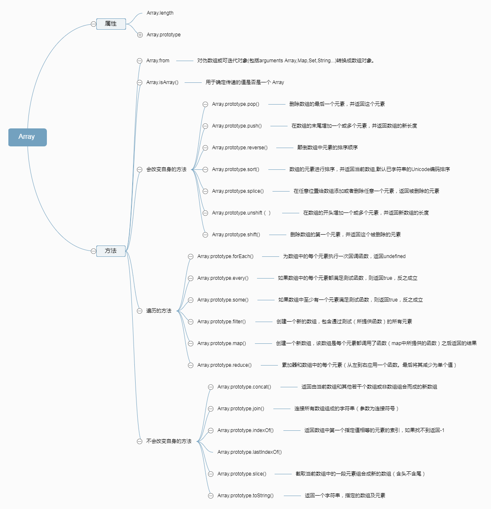

# <span style='color:rgb(230,3,135);'>Array类型</span>

ECMAScript数组的每一项可以保存任何类型的数据，而且数据的大小可以动态调整;
数组可以容纳任何类型的值；声明之后就可以向其中加入值，不需要预先设定大小

创建数组的两种基本方式：
>* 1.数组字面量(常用)
```python
var array=['1','2'];
```
>* 2.使用Array构造函数(不常用)
```python
 var array=new Array();
```
数组最后一项的索引始终是length-1;因此新一项的位置就是length；

## <span style='color:rgb(230,3,135);'>属性</span>
> Array.length：Array 构造函数的 length 属性，其值为1。
> Array.prototype:允许为所有数组对象附加属性。

### 检测数组方法:Array.isArray();


### 转化方法：toString(),valueOf(),toLocaleString();

## <span style='color:rgb(230,3,135);'>方法</span>
### <span style='color:rgb(230,3,135);'>Mutator 方法</span>

>* 下面的这些方法会改变调用它们的对象自身的值：

> [Array.prototype.pop()](https://developer.mozilla.org/zh-CN/docs/Web/JavaScript/Reference/Global_Objects/Array/pop): 删除数组的<span style="color:red;">最后</span>一个元素，并<span style="color:red;">返回这个元素</span>。

> [Array.prototype.push()](https://developer.mozilla.org/zh-CN/docs/Web/JavaScript/Reference/Global_Objects/Array/push):在数组的末尾<span style="color:red;">增加</span>一个或多个元素，并<span style="color:red;">返回数组的新长度</span>。

> [Array.prototype.shift()](https://developer.mozilla.org/zh-CN/docs/Web/JavaScript/Reference/Global_Objects/Array/shift):删除数组的<span style="color:red;">第一个</span>元素，并<span style="color:red;">返回这个元素</span>。

> [Array.prototype.unshift()](https://developer.mozilla.org/zh-CN/docs/Web/JavaScript/Reference/Global_Objects/Array/unshift):在数组的<span style="color:red;">开头</span>增加一个或多个元素，并<span style="color:red;">返回数组的新长度</span>。

> [Array.prototype.reverse()](https://developer.mozilla.org/zh-CN/docs/Web/JavaScript/Reference/Global_Objects/Array/reverse):颠倒数组中元素的排列顺序，即原先的第一个变为最后一个，原先的最后一个变为第一个。

> [Array.prototype.sort()](https://developer.mozilla.org/zh-CN/docs/Web/JavaScript/Reference/Global_Objects/Array/sort):对数组元素进行排序，并返回当前数组。

> [Array.prototype.splice()](https://developer.mozilla.org/zh-CN/docs/Web/JavaScript/Reference/Global_Objects/Array/splice):在任意的位置给数组添加或删除任意个元素。

### <span style='color:rgb(230,3,135);'>Accessor 方法</span>

>* 下面的这些方法绝对不会改变调用它们的对象的值，只会返回一个新的数组或者返回一个其它的期望值。

>[Array.prototype.concat()](https://developer.mozilla.org/zh-CN/docs/Web/JavaScript/Reference/Global_Objects/Array/concat): 返回一个由当前数组和其它若干个数组或者若干个非数组值组合而成的新数组。

>[Array.prototype.join()](https://developer.mozilla.org/zh-CN/docs/Web/JavaScript/Reference/Global_Objects/Array/join)
: 连接所有数组元素组成一个字符串。

>[Array.prototype.slice()](https://developer.mozilla.org/zh-CN/docs/Web/JavaScript/Reference/Global_Objects/Array/slice):
抽取当前数组中的一段元素组合成一个新数组。

<i>类数组转化为数组：Array.prototype.slice.call(arguments)</i>

> [Array.from()](https://developer.mozilla.org/zh-CN/docs/Web/JavaScript/Reference/Global_Objects/Array/from) :对伪数组或可迭代对象(包括arguments Array,Map,Set,String...)转换成数组对象。

>[Array.prototype.toString()](https://developer.mozilla.org/zh-CN/docs/Web/JavaScript/Reference/Global_Objects/Array/toString):
返回一个由所有数组元素组合而成的字符串。遮蔽了原型链上的 Object.prototype.toString() 方法。

>[Array.prototype.toLocaleString()](https://developer.mozilla.org/zh-CN/docs/Web/JavaScript/Reference/Global_Objects/Array/toLocaleString):
返回一个由所有数组元素组合而成的本地化后的字符串。遮蔽了原型链上的 Object.prototype.toLocaleString() 方法。

>[Array.prototype.indexOf()](https://developer.mozilla.org/zh-CN/docs/Web/JavaScript/Reference/Global_Objects/Array/indexOf):
返回数组中第一个与指定值相等的元素的索引，如果找不到这样的元素，则返回 -1。

>[Array.prototype.lastIndexOf()](https://developer.mozilla.org/zh-CN/docs/Web/JavaScript/Reference/Global_Objects/Array/lastIndexOf):
返回数组中最后一个（从右边数第一个）与指定值相等的元素的索引，如果找不到这样的元素，则返回 -1。

### <span style='color:rgb(230,3,135);'>Iteration 方法</span>

>* 在下面的众多遍历方法中，有很多方法都需要指定一个回调函数作为参数。在回调函数执行之前，数组的长度会被缓存在某个地方，所以，如果你在回调函数中为当前数组添加了新的元素，那么那些新添加的元素是不会被遍历到的。此外，如果在回调函数中对当前数组进行了其它修改，比如改变某个元素的值或者删掉某个元素，那么随后的遍历操作可能会受到未预期的影响。总之，不要尝试在遍历过程中对原数组进行任何修改，虽然规范对这样的操作进行了详细的定义，但为了可读性和可维护性，请不要这样做。

> [Array.prototype.forEach()](https://developer.mozilla.org/zh-CN/docs/Web/JavaScript/Reference/Global_Objects/Array/forEach):
为数组中的<span style="color:red">每个元素执行一次回调函数</span>.

> [Array.prototype.every()](https://developer.mozilla.org/zh-CN/docs/Web/JavaScript/Reference/Global_Objects/Array/every):
如果数组中的<span style="color:red">每个元素都满足测试函数，则返回 true，否则返回 false。</span>

> [Array.prototype.some()](https://developer.mozilla.org/zh-CN/docs/Web/JavaScript/Reference/Global_Objects/Array/some):
如果数组中<span style="color:red">至少有一个元素满足测试函数，则返回 true，否则返回 false。</span>

> [Array.prototype.filter()](https://developer.mozilla.org/zh-CN/docs/Web/JavaScript/Reference/Global_Objects/Array/filter):
将所有在<span style="color:red">过滤函数中返回 true 的数组元素放进一个新数组中并返回。</span>

> [Array.prototype.map()](https://developer.mozilla.org/zh-CN/docs/Web/JavaScript/Reference/Global_Objects/Array/map):
返回一个由<span style="color:red">回调函数的返回值组成的新数组</span>。

> [Array.prototype.reduce()](https://developer.mozilla.org/zh-CN/docs/Web/JavaScript/Reference/Global_Objects/Array/reduce):
<span style="color:red">从左到右</span>为每个数组元素执行一次回调函数，并把上次回调函数的返回值放在一个暂存器中传给下次回调函数，并返回最后一次回调函数的返回值。

> [Array.prototype.reduceRight()](https://developer.mozilla.org/zh-CN/docs/Web/JavaScript/Reference/Global_Objects/Array/reduceRight):
<span style="color:red">从右到左</span>为每个数组元素执行一次回调函数，并把上次回调函数的返回值放在一个暂存器中传给下次回调函数，并返回最后一次回调函数的返回值。
