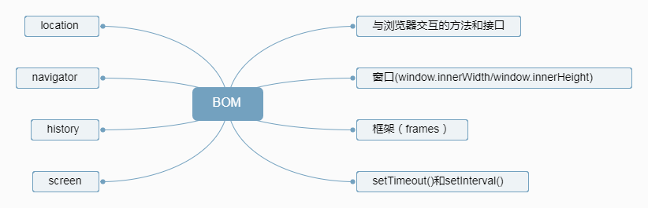

# BOM

 BOM 提供与浏览器交互的方法和接口，用于访问浏览器的功能，功能和任何网页内容没有关系；(除了 navagator 对象用的比较多之外，其余的不常用)

>* 弹出新浏览器窗口的功能

>* 移动，缩放和关闭浏览器窗口的功能

>* 提供浏览器详细信息的 navigator 对象；

>* 提供浏览器所加载页面的详细信息的location对象

>* 提供用户显示器分辨率详细信息的screen对象

>* 对cookies的支持

BOM的核心对象是window；window有双重身份，既是JavaScript访问浏览器窗口的一个接口，又是ECMAScript规定的Global对象；

## 全局作用域

在全局作用域中声明的变量，函数都会变成了window对象的属性和方法

## 窗口关系及框架
如果页面中包含框架，则每个框架都有自己的 window 对象，并且保存在 frames 集合中；使用框架的情况之下，浏览器中会存在多个Global对象，每个对象的构造一一对应，但并不相等；

> window.innerWidth：页面视图区的大小减去边框宽度；(window.height同理);

## 间歇调用(setTimeout)和超时调用(setInterval)

间歇调用(setTimeout())：在指定的时间过后执行代码；常用

超时调用(setInterval()):每隔指定的时间就执行一次；不常用；

<b>这两个我们都不常用，动画效果我们基本用css3的动画相关属性；或者h5的新增APIwindow.requestAnimationFrame()代替</b>

## location对象

<b>location是最有用的BOM对象之一</b>，他提供了与当前窗口中加载的文档有关的信息；location对象既是window对象的属性也是document对象的属性；
属性
>* [location.hash](http://www.w3school.com.cn/jsref/prop_loc_hash.asp):返回URL中hash（#号后面零或多个字符），如果URL中不包含散列，则返回空字符串

>* [location.host](http://www.w3school.com.cn/jsref/prop_loc_host.asp):可设置或返回当前 URL 的主机名称和端口号。

>* [location.href](http://www.w3school.com.cn/jsref/prop_loc_href.asp):可设置或返回当前显示的文档的完整 URL。

>* [location.search](http://www.w3school.com.cn/jsref/prop_loc_search.asp):可设置或返回当前 URL 的查询部分（问号 ? 之后的部分）;

>* [location.path.name](http://www.w3school.com.cn/jsref/prop_loc_pathname.asp):可设置或返回当前 URL 的路径部分。

## [navigator](http://www.w3school.com.cn/jsref/dom_obj_navigator.asp) 对象
navigation对象：识别客户端浏览器的事实标准

## [screen](http://www.w3school.com.cn/jsref/dom_obj_screen.asp)对象：在编程中用处不大

## [history](http://www.w3school.com.cn/jsref/dom_obj_history.asp)对象:在编程中用处不大
