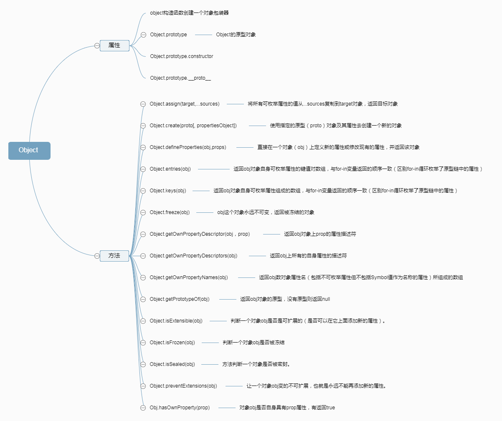

# Object

## Object对象属性
> Object.length=1

> Object.prototype：可以为所有 Object 类型的对象添加属性。

## Object对象方法：

[Object.assign()](https://developer.mozilla.org/zh-CN/docs/Web/JavaScript/Reference/Global_Objects/Object/assign)：通过复制一个或多个对象来创建一个新的对象。

[Object.create()](https://developer.mozilla.org/zh-CN/docs/Web/JavaScript/Reference/Global_Objects/Object/create)：指定原型对象和属性来创建一个新的对象。

[Object.defineProperty()](https://developer.mozilla.org/zh-CN/docs/Web/JavaScript/Reference/Global_Objects/Object/defineProperty)：给对象添加一个属性并指定该属性的配置。

[Object.defineProperties()](https://developer.mozilla.org/zh-CN/docs/Web/JavaScript/Reference/Global_Objects/Object/defineProperties)：给对象添加多个属性并分别指定它们的配置。

[Object.freeze()](https://developer.mozilla.org/zh-CN/docs/Web/JavaScript/Reference/Global_Objects/Object/freeze)：冻结对象：使对象不可删除或修改它的属性。

[Object.getOwnPropertyDescriptor()](https://developer.mozilla.org/zh-CN/docs/Web/JavaScript/Reference/Global_Objects/Object/getOwnPropertyDescriptor)：返回对象指定的属性配置。

[Object.getOwnPropertyNames()](https://developer.mozilla.org/zh-CN/docs/Web/JavaScript/Reference/Global_Objects/Object/getOwnPropertyNames)：返回一个数组，它包含了指定对象所有的可枚举或不可枚举的属性名。

[Object.getOwnPropertySymbols()](https://developer.mozilla.org/zh-CN/docs/Web/JavaScript/Reference/Global_Objects/Object/getOwnPropertySymbols)：返回一个数组，它包含了指定对象自身所有的符号属性。

[Object.getPrototypeOf()](https://developer.mozilla.org/zh-CN/docs/Web/JavaScript/Reference/Global_Objects/Object/getPrototypeOf)：返回指定对象的原型对象。

[Object.is()](https://developer.mozilla.org/zh-CN/docs/Web/JavaScript/Reference/Global_Objects/Object/is)：判断两个值是否严格相等。（类似===运算符，但+0不等于-0，NaN等于自己）。

[Object.isExtensible()](https://developer.mozilla.org/zh-CN/docs/Web/JavaScript/Reference/Global_Objects/Object/isExtensible)：判断对象是否可扩展。

[Object.isFrozen()](https://developer.mozilla.org/zh-CN/docs/Web/JavaScript/Reference/Global_Objects/Object/isFrozen)：判断对象是否已经冻结。

[Object.isSealed()](https://developer.mozilla.org/zh-CN/docs/Web/JavaScript/Reference/Global_Objects/Object/isSealed)：判断对象是否已经密封。

[Object.keys()](https://developer.mozilla.org/zh-CN/docs/Web/JavaScript/Reference/Global_Objects/Object/keys)：返回一个数组，包含指定对象的所有自有可遍历<b>属性的名称</b>
。
Object.preventExtensions()：阻止对象扩展。

[Object.seal()](https://developer.mozilla.org/zh-CN/docs/Web/JavaScript/Reference/Global_Objects/Object/seal)：密封对象以防删除。

[Object.setPrototypeOf()](https://developer.mozilla.org/zh-CN/docs/Web/JavaScript/Reference/Global_Objects/Object/setPrototypeOf)：设置对象的原型。

所有对象都有：toString(),valueOf(),toLocaleString()方法;

 JavaScript共享本质，可能会导致对象被意外修改或者重写原生对象；一旦对象定义被修改，就无法撤回；

 解决办法： 防篡改对象

>* 1.不可扩展对象：Object.preventExtensions(),
>* 2.冻结对象：Object.freeze()
>* 3.密封对象：Object.seal() 