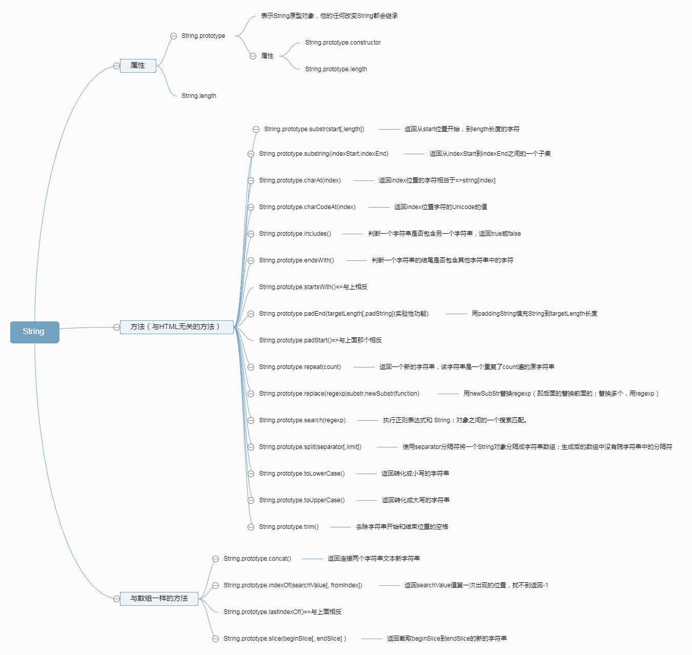

#### String类型

字符串是类数组，拥有字符串的length以及indexOf(),concat()方法，但不是字符串数组

字符串和数组的区别：

> 字符串是不可变的：字符串的成员函数不会改变其原始值，返回并创建一个新的字符串；

> 数组是可变的: 数组的成员函数都是在其原始值上进行操作

String 方法

>* [String.prototype.charAt()](https://developer.mozilla.org/zh-CN/docs/Web/JavaScript/Reference/Global_Objects/String/charAt)
:返回特定位置的字符。

>* [String.prototype.charCodeAt()](https://developer.mozilla.org/zh-CN/docs/Web/JavaScript/Reference/Global_Objects/String/charCodeAt):
返回表示给定索引的字符的Unicode的值。

>* [String.prototype.concat()](https://developer.mozilla.org/zh-CN/docs/Web/JavaScript/Reference/Global_Objects/String/concat):
连接两个字符串文本，并返回一个新的字符串。

>* [String.prototype.includes()](https://developer.mozilla.org/zh-CN/docs/Web/JavaScript/Reference/Global_Objects/String/includes):
判断一个字符串里是否包含其他字符串。

>* [String.prototype.endsWith()](https://developer.mozilla.org/zh-CN/docs/Web/JavaScript/Reference/Global_Objects/String/endsWith):
判断一个字符串的结尾是否包含其他字符串中的字符。

>* [String.prototype.indexOf()](https://developer.mozilla.org/zh-CN/docs/Web/JavaScript/Reference/Global_Objects/String/indexOf):
从字符串对象中返回首个被发现的给定值的索引值，如果没有找到则返回-1。

>* [String.prototype.lastIndexOf()](https://developer.mozilla.org/zh-CN/docs/Web/JavaScript/Reference/Global_Objects/String/lastIndexOf)
:从字符串对象中返回最后一个被发现的给定值的索引值，如果没有找到则返回-1。

>* [String.prototype.match()](https://developer.mozilla.org/zh-CN/docs/Web/JavaScript/Reference/Global_Objects/String/match):
使用正则表达式与字符串相比较。

>* [String.prototype.repeat()](https://developer.mozilla.org/zh-CN/docs/Web/JavaScript/Reference/Global_Objects/String/repeat):
返回指定重复次数的由元素组成的字符串对象。

>* [String.prototype.replace()](https://developer.mozilla.org/zh-CN/docs/Web/JavaScript/Reference/Global_Objects/String/replace):
被用来在正则表达式和字符串直接比较，然后用新的子串来替换被匹配的子串。
>* [String.prototype.search()](https://developer.mozilla.org/zh-CN/docs/Web/JavaScript/Reference/Global_Objects/String/search):
对正则表达式和指定字符串进行匹配搜索，返回第一个出现的匹配项的下标。

>* [String.prototype.slice()](https://developer.mozilla.org/zh-CN/docs/Web/JavaScript/Reference/Global_Objects/String/slice):
摘取一个字符串区域，返回一个新的字符串。
>* [String.prototype.split()](https://developer.mozilla.org/zh-CN/docs/Web/JavaScript/Reference/Global_Objects/String/split):
通过分离字符串成字串，将字符串对象分割成字符串数组。

>* [String.prototype.substr()](https://developer.mozilla.org/zh-CN/docs/Web/JavaScript/Reference/Global_Objects/String/substr):
通过指定字符数返回在指定位置开始的字符串中的字符。

>* [String.prototype.substring()](https://developer.mozilla.org/zh-CN/docs/Web/JavaScript/Reference/Global_Objects/String/substring):
返回在字符串中指定两个下标之间的字符。

>* [String.prototype.toLowerCase()](https://developer.mozilla.org/zh-CN/docs/Web/JavaScript/Reference/Global_Objects/String/toLowerCase):
将字符串转换成小写并返回。

>* [String.prototype.toUpperCase()](https://developer.mozilla.org/zh-CN/docs/Web/JavaScript/Reference/Global_Objects/String/toUpperCase):
将字符串转换成大写并返回。

>* [String.prototype.trim()](https://developer.mozilla.org/zh-CN/docs/Web/JavaScript/Reference/Global_Objects/String/trim):
从字符串的开始和结尾去除空格。
