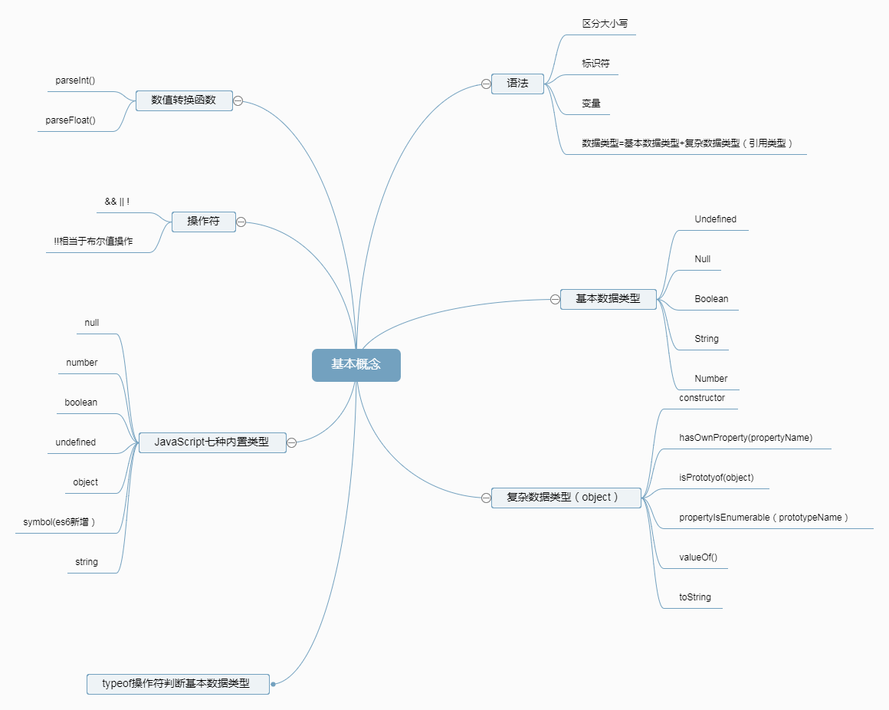
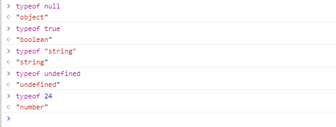

# 基本概念

## 语法：
> 1.ECMAScript中的一切都区分大小写;

> 2.标识符：变量，函数，属性，函数参数的名字；（常采用驼峰大小写格式）
（注：1.第一个字符必须是字母，下划线（_)或美元($),第二个字符可以是字母，下划线（_)，美元($),数字)；
     2.关键字，保留字，true，false，null不能作为标识符；
)

> 3.变量： var后面加标识符，例如： var a;变量是没有类型的，只有值才有；即<i>变量可以是任何类型的值</i>

> 4.数据类型=基本数据类型+复杂数据类型（引用数据类型）；
JavaSricarpt有七种内置类型：

<b><i>空值:(null),未定义:(undefined),布尔值:(boolean),数字：(number),对象:(object),字符串:(string),符号：(symbol ES6中新增)

除了对象之外。其他的都称“基本类型";</i></b>

她们的类型和她们的字符串值并不是一一对应，用typeof操作符判断基本数据类型，返回数据类型；是一个操作符，不是函数，<b>（null，是个特例）</b>；如图：


function(函数)也是JavaScript的一个内置类型，实际上他是object的一个'子类型',<i>函数是可以调用的对象</i>

### 基本数据类型： undefined,Null,Boolean,Number,String,symbol;

>* undefined：未初始化的变量自动赋值undefined(变量在未持有值的时候）；

检测变量是否被声明最好使用

```python
    if(typeof a==='undefined'){
        a=function(){};
    }
```

>* null：null值表示一个空对象的指针；如果变量将来用于保存对象，最好初始化的时候赋值null，可以进一步区分undefined和null；

>* Boolean：0,"",false,null,undefined,NaN返回false，其余都返回true;

>* number：包括整数和待小数的十进制；NaN不是数字的数字

最基本的数值字面量是十进制（0-9）（常用）；

八进制（0-7）字面值的第一位必须是0（如果字面值超出了范围，自动解析为十进制，严格模式底下无效）；

十六进制字面值的前两位必须是0x；

在进行算术计算的时候，八进制和十六进制表示的数值最终都将被转化为十进制；

浮点数值需要保存的内存空间时保存整数数值的两倍

数值范围：Infinity（Infinity->正无穷，-Infinity->负无穷）；isFinite()函数，判断是否是在有效数字范围内；

NaN：不是数字的数字，NaN与任何值都不相等，包括本身；!isNaN()函数，判断是否是一个数字；

##### 数值转换的三个函数：
> Number():任何数据类型转换为数值；

> parseInt():专门把字符串转换成整型数值,(常用，不具备解析八进制值的能力，第一次参数表示要转行的字符串，第二个参数表示转化是使用的多少进制)

>parseFloat():专门把字符串转换成浮点数值
String类型:字符串是不可变的，若要改变某个变量的字符串，首先需要销毁原来的字符串，然后再用一个新值的字符串填充该变量；

### 复杂数据类型： Object（Object本质上是由一组无序的名值对组成；）

#### Object类型：ECMAScript中的对象其实就是一组数据和功能的集合，Object是所有对象的基础，因此所有对象都具有这些基本的属性和方法；

Object的每个实例都具有的属性和方法（了解即可，不需要深入）：

constructor：保存着用于创建当前对象的函数（后面原型对象，原型链中会用到）；

hasOwnProperty(propertyName):检查给定的属性是否在当前对象实例中（后面会详细讲解，比较）

isPrototyOf(object):用于检查传入的对象是否在当前对象的原型（后面会讲到原型）

propertyIsEnumerable（prototypeName）：属性是否可枚举；

toLocaleString():返回对象的字符串表示，该字符串与执行环境的地区对应；

toString：返回对象的字符串表示；

valueOf():返回对象的字符串，数值，布尔值表示；


### 操作符：（常用）
!!->相当于布尔值操作

&& ||->短路操作

循环语句：

遍历数组使用传统的for循环；输出属性名的顺序可预测；

可枚举对象属性遍历使用for-in；输出属性名的顺序不可预测；

break：退出循环，不在执行循环；

continue：退出循环，再继续重头开始执行当前循环体

函数：function关键字声明，可以封装任意多条语句，可以在任何地方，任何时候调用执行；

任何函数都可以通过return语句跟要返回的值来实现返回值；

return；表示提前停止函数执行而又不需要返回值的情况；

函数传参数：没有传递值的命名参数将自动被赋予undefined；多余的参数自动忽略；

