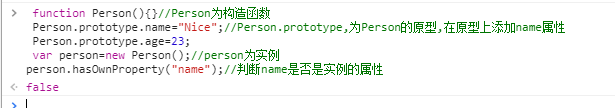
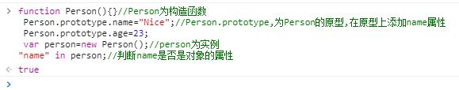
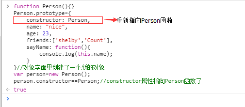
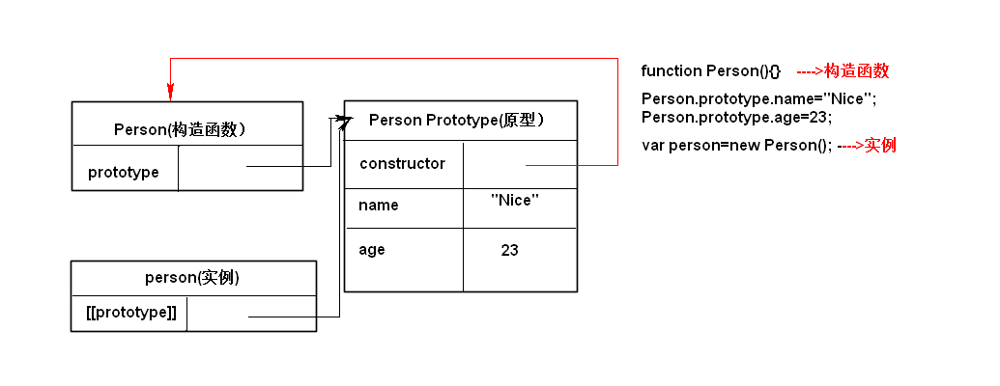
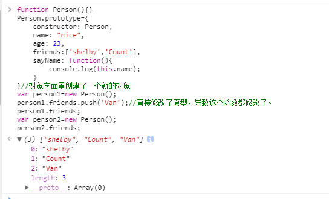
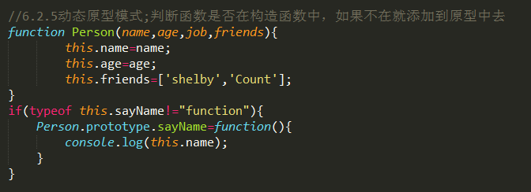
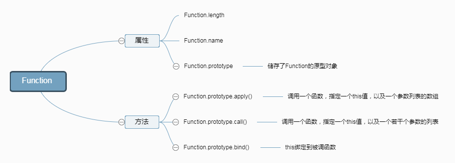
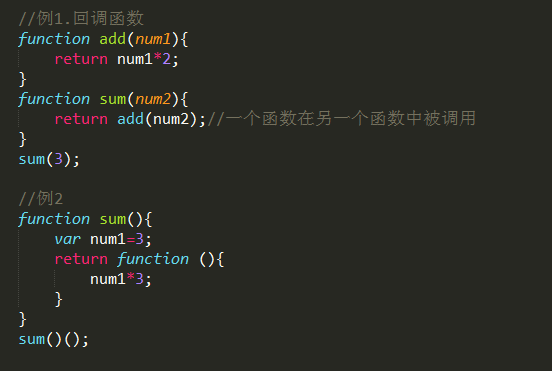
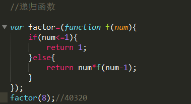
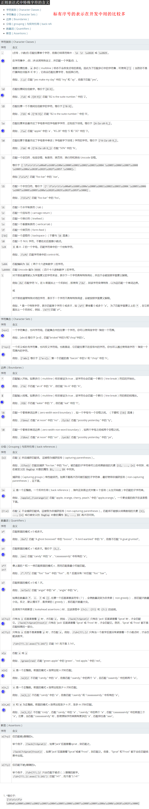

# <span style='color:rgb(230,3,135);'>引用类型</span>

 >
> 引用类型的值（对象）是引用类型的一个实例；在ECMAScript中，引用类型是一种数据结构，用于将数据和功能组织在一起；

<i>对象是某个特定引用类型的实例</i>

基本类型值：简单的数据段；复制变量是复制变量的值；占据固定大小的空间，保存在栈内存中；

引用类型值：由多个值构成的对象，复制对象是对象的地址（指针）；保存在堆内存中；函数是对象的一个子集

所有函数的参数都是按值传递的，参数是函数的局部变量；形参和实参最好不要一样，以免混淆；

检测类型：

typeof操作符确定一个变量是基本类型中的哪一种

instanceof操作符检测引用类型和基本类型；基本类型返回false；

执行环境：变量或者函数有权访问的其他数据，决定了她们各自的行为，每个执行环境都有一个变量对象；代码在环境中执行的时候会创建变量对象的一个作用域链；
访问局部变量比全局变量块；

 <h2 ><a style='color:rgb(230,3,135);'>Object类型</a></h2>
目前我们接触的大多数引用类型值都是Object类型的实例

Object创建的方法：
>* 1.对象字面量
```python
var person={
    name: "Nice,
    age: 23
}
```
优点：代码量少，给人封装数据的感觉，也可以向函数传递大量可选参数；在实际开发中常用

>* 2.new 操作符后跟Object构造函数
```python
var person=new Object();
person.name="Nice;
person.age=23；
```
在开发中用的比较少
>* 3.工厂模式
```python
function createPerson(name,age){
    var o=new Object();
    o.name=name;
    o.age=age;
    return o;
}
var person=createPerson("Nice",23);
```
在开发中用的比较少

>* 4.构造函数模式
```python
function Person(name,age){
    this.name=name;
    this.age=age；
    this.sayName=function(){
        this.name;
    }
}
var person=new Person("Nice",23);
```
构造函数始终都应该以一个大写字母开头；
调用构造函数经历四个步骤：
> 1.创建一个新对象

> 2.将构造函数的作用域赋给新对象（this就职向这个新对象）

> 3.执行构造函数中的代码

> 4.返回新的对象

实例person有一个constructor（构造函数）属性，该属性指向Person（原型）；

构造函数的问题：每个方法都要在每个实例上重新创建创建一遍,不同的实例的同名函数是不想等；创建重复的方法；

解决构造函数：原型模式

每个函数都有一个prototype（原型）属性，这个属性是一个指针，指向一个原型对象；实例共享原型对象的属性和方法；

原型对象：只要创建了一个新函数，就会为该函数创建一个prototype属性，这个属性指向函数的原型对象。

在默认情况下，原型对象都会自动获取一个constructor（构造函数）属性，这个属性是一个指向prototype属性所在的指针；
即Person.prototype.constructor==Person;如图所示


>* Object.getPrototypeOf()返回的是对象实际就是这个对象的原型,如图所示

>* hasOwnProperty()方法检测一个属性是否存在实例中还是存在原型中，存在实例中返回true；反之,成立；

>* in操作符会在通过对象对象能够访问给定属性时返回true；无论该属性存在实例还是原型中；

> 只要hasOwnProperty()返回false，in操作符返回true；则该属性是原型属性；

>* for-in循环时，返回的是所有能够通过对象（包括原型属性和实例属性）访问的，可枚举的属性；

>* Object.keys(),返回对象上所有可枚举的实例属性的字符串数组；


> 注意：Person.prototype设置为一个对象字面量形式创建的新对象时，就切断了原来对象的联系（即constructor属性不在指向Person）

如果constructor的值很重要可以向在新对象中设置：

原因是，实例和原型之间的松散链接关系，实例中的指针只指向原型，而不指向构造函数

原型，原型对象，实例关系如下


原型对象的问题：修改实例造成原型对象被修改，共享本性所导致


解决方法：组合使用构造函数和原型模式,共同的属性和方法放到原型之上




继承
许多OO语言都支持两种继承方式：接口继承和现实继承；接口继承只继承方法签名，实现继承则继承实际的方法；但是由于函数没有签名，所有ECMAScript只支持实际继承。实现继承主要依靠原型链来实现；

利用原型让一个引用类型继承另一个引用类型的属性和方法；


> 1.在创建的对象中，数值属性名会自动转换字符串

> 2.一般来说访问对象的属性都是采用点表示法；方括号语法主要的优点是可以通过变量访问属性；除非我们必须要用变量来访问属性。否则一般不用方括号语法

 <h3 ><a style='color:rgb(230,3,135);' href="Object.md">Object的属性和方法</a></h3>

## <span style='color:rgb(230,3,135);' >Array类型</span>
<i>ECMAScript数组的每一项可以保存任何类型的数据，而且数据的大小可以动态调整;

数组可以容纳任何类型的值；声明之后就可以向其中加入值，不需要预先设定大小</i>

创建数组的两种基本方式：
>* 1.数组字面量(常用)
```python
var array=['1','2'];
```
>* 2.使用Array构造函数(不常用)
```python
 var array=new Array();
```
数组最后一项的索引始终是length-1;因此新一项的位置就是length；

 <h3 ><a style='color:rgb(230,3,135);' href="Array.md">Array的属性和方法</a></h3>

## <span style='color:rgb(230,3,135);' >Function 类型</span>


函数实际上是对象，每个函数都是Function类型的实例,函数名实际上是指向函数对象的指针。
函数创建的两种方式：函数声明和函数表达式(匿名函数，拉姆达函数)


<b><i>调用函数sum();访问函数sum;</i></b>

<b>函数声明和函数表达式的区别：</b>
>* 1.解析器会率先读取函数声明，并在执行任何代码之前可以访问；函数表达式必须等到解析器执行到他所造的代码才会真正被解析<b>（函数声明会提前；函数表达式不会）</b>;
>* 2.函数声明后面不能跟圆括号；表达式可以；
>* 3.函数声明只能创建局部函数；因为未经var关键字声明的变量自动变成全局变量，所以函数表达式可创建全局函数

函数名本身是变量，所以函数也可以作为值来使用；即可以把函数作为参数传递给另一个函数，也可以把函数作为另一函数的结果返回；<b>在开发中经常用到，</b>例如回调函数(callback function)，闭包....


> 递归函数：一个函数通过调用名字调用自身；


> 闭包：有权访问另一个函数作用域中变量的函数


注意：闭包只能取得包含函数中任何变量的最后一个值，闭包保存的是整个变量对象，而不是某个特殊的变量；闭包会比其他函数占用更多的内存，<b>因此慎重使用闭包；</b>


this对象是在运行时基于函数的执行环境绑定的；匿名函数和定时器的执行环境具有全局性，因此this指向window；详细请见[this全面解析]();

<b><i>JavaScript没有块级作用域，我们常用匿名函数模仿块级作用域；</i></b> 
```python
(function(){
    //这里是块级作用域
})
```
私有变量：任何在函数中定义的变量，都可以认为是私有变量；因为函数的外部不能访问这些变量，私有变量包括函数的参数，局部变量，函数内部定义的其他函数
特权方法：有权访问私有变量和私有函数的公共方法；利用私有和特权成员，可以隐藏那些不应该被直接修改的数据

### <span style='color:rgb(230,3,135);'>Function的方法</span>

<i>原生函数：String(),Number(),Boolean(),Array(),Object(),Function(),RegExp(),Date(),Error(),Symbol();
原生函数可以直接当做构造函数来使用；构造函数创建出来的是封装了基本类型的值的封装对象</i>
>* [Function.prototype.apply()](https://developer.mozilla.org/zh-CN/docs/Web/JavaScript/Reference/Global_Objects/Function/apply):在一个对象的上下文中应用另一个对象的方法；参数能够以数组形式传入。
>* [Function.prototype.bind()](https://developer.mozilla.org/zh-CN/docs/Web/JavaScript/Reference/Global_Objects/Function/apply):bind()方法会创建一个新函数,称为绑定函数.当调用这个绑定函数时,绑定函数会以创建它时传入 bind()方法的第一个参数作为 this,传入 bind()方法的第二个以及以后的参数加上绑定函数运行时本身的参数按照顺序作为原函数的参数来调用原函数.
>* [Function.prototype.call()](https://developer.mozilla.org/zh-CN/docs/Web/JavaScript/Reference/Global_Objects/Function/call)
:在一个对象的上下文中应用另一个对象的方法；参数能够以列表形式传入。


## <span style='color:rgb(230,3,135);' >RegExp类型</span>
<i>RegExp 构造函数创建了一个正则表达式对象，用于将文本与一个模式匹配。</i>

创建正则的三种方式：
```python
1.构造函数创建
var reg=newnew RegExp(pattern [, flags]) //例如：var reg=new RegExp('ab+c', 'i');

2.字面量创建
var reg=/pattern/flags  //例如：var reg=/ab+c/i;
```
pattern：可以是字符类,限定类，分组，向前查找以及反向引用
flags：g->表示全局模式；i->表示不区分大小；m->表示多少行
正则匹配表：



### <span style='color:rgb(230,3,135);' >方法</span>

>* [RegExp.prototype.exec()](https://developer.mozilla.org/zh-CN/docs/Web/JavaScript/Reference/Global_Objects/RegExp/exec):在目标字符串中执行一次正则匹配操作。
>* [RegExp.prototype.test()](https://developer.mozilla.org/zh-CN/docs/Web/JavaScript/Reference/Global_Objects/RegExp/test):测试当前正则是否能匹配目标字符串。

## <span style='color:rgb(230,3,135);' >Date类型</span>
Date用构造函数创建

var date=new Date()

### <span style='color:rgb(230,3,135);' >属性</span>

> Date.prototype:允许为 Date 实例对象添加属性。
> Date.length:Date.length 的值是 7。这是该构造函数可接受的参数个数。
### <span style='color:rgb(230,3,135);' >方法</span>

> [Date.now()](https://developer.mozilla.org/zh-CN/docs/Web/JavaScript/Reference/Global_Objects/Date/now):返回自 1970-1-1 00:00:00  UTC (世界标准时间)至今所经过的毫秒数。

> [Date.parse()](https://developer.mozilla.org/zh-CN/docs/Web/JavaScript/Reference/Global_Objects/Date/parse):解析一个表示日期的字符串，并返回从 1970-1-1 00:00:00 所经过的毫秒数。

> [Date.UTC()](https://developer.mozilla.org/zh-CN/docs/Web/JavaScript/Reference/Global_Objects/Date/UTC):接受和构造函数最长形式的参数相同的参数（从2到7），并返回从 1970-01-01 00:00:00 UTC 开始所经过的毫秒数

### <span style='color:rgb(230,3,135);' >基本包装类型</span>
<i>为了便于操作基本类型值，ECMAScript提供了3个特别的引用类型：Boolean,Number,String;</i>

基本类型与包装类型的主要区别在于对象的生存周期；使用new操作符创建的引用类型的实例，在执行流离开当前作用域之前都一直保存在内存中；而自动创建的基本包装类型对象，则只存在于一行代码的执行瞬间，然后立即被销毁；意味着我们不能在运行时为基本类型值添加属性和方法；

##  <span style='color:rgb(230,3,135);' >String类型</span>
字符串是类数组，拥有字符串的length以及indexOf(),concat()方法，但不是字符串数组

字符串和数组的区别：

> 字符串是不可变的：字符串的成员函数不会改变其原始值，返回并创建一个新的字符串；

> 数组是可变的: 数组的成员函数都是在其原始值上进行操作

 <h3 ><a style='color:rgb(230,3,135);' href="String.md">String的属性和方法</a></h3>
### 内置对象
开发人员不必显式地实例化内置对象，因为他们已经实例化
例如： isNaN(),isFinite(),parseInt(),parseFloat(),encodeURL(),encodeURIComponent(),Math对象的所有方法